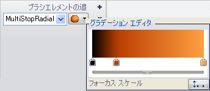

////

|metadata|
{
    "name": "wingauge-apply-the-multi-stop-radial-gradient-brush-element-using-the-gauge-designer",
    "controlName": ["WinGauge"],
    "tags": ["Charting","Design Environment"],
    "guid": "{F1B1CBEA-B35B-4E21-97C2-55E74F637AA0}",  
    "buildFlags": [],
    "createdOn": "0001-01-01T00:00:00Z"
}
|metadata|
////

= ゲージ デザイナを使用してマルチストップ放射型グラデーション ブラシ エレメントを適用

ゲージのプロパティの 3 色以上を円形に相互に混ぜたい場合には、マルチストップ放射型グラデーション ブラシ エレメントをプロパティに適用します。

*ゲージ デザイナを使用してマルチストップ放射型グラデーション ブラシ エレメントをプロパティに適用するには、次の手順に従ってください。*

[start=1]
. ゲージ エクスプローラまたはインタラクティブなプレビュー領域で、マルチストップ放射型グラデーション ブラシ エレメントを適用したいプロパティを選択します。
[start=2]
. [プロパティ] パネルの [外観] タブで、[タイプ] ドロップダウン リストから [MultiStopRadialGradient] を選択します。
[start=3]
. [詳細] ドロップダウン矢印をクリックします。
[start=4]
. グラデーション エディタで、カラー スケールの下をクリックして新しいカラー ストップを追加します。
[start=5]
. カラー ストップを右クリックして、色を変更します。
[start=6]
. カラー ストップをドラッグして、オフセットを変更します。
[start=7]
. 以下の手順によって、より正確に値を編集することができます。
[start=8]
. 水平バーで小さい矢印をクリックします。次に以下のプロパティを設定します。

** 開始色 - 最初の行の最初のセルをクリックします。ドロップダウン矢印をクリックします。カラー ピッカーが表示します。左側で、[Web] をクリックし、次に [黒] を選択します。
** 開始色オフセット - 最初の行の 2 番目のセルをクリックします。テキスト ボックスに 0 という値を入力します。
** カラー ストップ - 2 番目の行の最初のセルをクリックします。テキスト ボックスに 186, 0, 0 という値を入力します。
** カラー ストップ オフセット - 2 番目の行の 2 番目のセルをクリックします。テキスト ボックスに 0.264 という値を入力します。
** 終了色 - 3 番目の行の最初のセルをクリックします。テキスト ボックスに 254, 127, 0 という値を入力します。
** 終了色オフセット - 3 番目の行の 2 番目のセルをクリックします。テキスト ボックスに 1 という値を入力します。

[start=9]
. グラデーション エディタで、[フォーカス スケール] ボタンをクリックします。フォーカス スケール エディタが表示します。水平および垂直スライダー バーを使用して、囲み点を選択します。円では、小さい円をドラッグして中心点を設定します。
[start=10]
. プロパティの指定が終了したら、[ブラシ] ペインの任意の場所をクリックします。
[start=11]
. インタラクティブなプレビュー領域で、ゲージの選択されたプロパティに適用されたマルチストップ放射型グラデーション ブラシ エレメントを確認できます。

== 関連トピック

link:wingauge-multi-stop-radial-gradient-brush-element.html[マルチストップ放射型グラデーション ブラシ エレメント]

link:wingauge-apply-the-multi-stop-radial-gradient-brush-element-at-design-time.html[デザインタイムにマルチストップ放射型グラデーション ブラシ エレメントを適用]

link:wingauge-apply-the-multi-stop-radial-gradient-brush-element-at-run-time.html[ランタイムにマルチストップ放射型グラデーション ブラシ エレメントを適用]