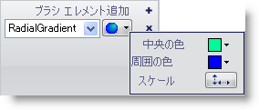

////

|metadata|
{
    "name": "wingauge-apply-the-radial-gradient-brush-element-using-the-gauge-designer",
    "controlName": ["WinGauge"],
    "tags": ["Charting","Design Environment"],
    "guid": "{2C97AB45-7717-403D-9F3E-9EB1FDCF9F81}",  
    "buildFlags": [],
    "createdOn": "0001-01-01T00:00:00Z"
}
|metadata|
////

= ゲージ デザイナを使用して放射型グラデーション ブラシ エレメントを適用

ゲージのプロパティの 2 色を円形に相互に混ぜたい場合には、放射型グラデーション ブラシ エレメントをプロパティに適用します。

*ゲージ デザイナを使用して放射型グラデーション ブラシ エレメントをゲージのプロパティに適用するには、次の手順に従ってください。*

[start=1]
. ゲージ エクスプローラまたはインタラクティブなプレビュー領域で、放射型グラデーション ブラシ エレメントを適用したいプロパティを選択します。
[start=2]
. [プロパティ] パネルの [外観] タブで、[タイプ] ドロップダウン リストから [RadialGradient] を選択します。
[start=3]
. [詳細] ドロップダウン矢印をクリックします。
[start=4]
. グラデーション エディタで、以下のプロパティを設定します。

** 中央の色 - ドロップダウン矢印をクリックします。カラー ピッカーが表示します。左側で、[Web] をクリックし、次に [Peach Puff] を選択します。
** 周囲の色 - ドロップダウン矢印をクリックします。カラー ピッカーが表示します。左側で、[Web] をクリックし、次に [Sandy Brown] を選択します。

[start=5]
. グラデーション エディタで、[フォーカス スケール] ボタンをクリックします。フォーカス スケール エディタが表示します。水平および垂直スライダー バーを使用して、囲み点を選択します。円では、小さい円をドラッグして中心点を設定します。
[start=6]
. プロパティの指定が終了したら、[ブラシ] ペインの任意の場所をクリックします。
[start=7]
. インタラクティブなプレビュー領域で、ゲージの選択されたプロパティに適用された放射型グラデーション ブラシ エレメントを確認できます。

== 関連トピック

link:wingauge-radial-gradient-brush-element.html[放射型グラデーション ブラシ エレメント]

link:wingauge-apply-the-radial-gradient-brush-element-at-design-time.html[デザインタイムに放射型グラデーション ブラシ エレメントを適用]

link:wingauge-apply-the-radial-gradient-brush-element-at-run-time.html[ランタイムに放射型グラデーション ブラシ エレメントを適用]