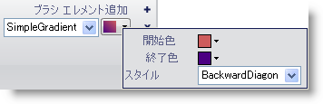

////

|metadata|
{
    "name": "wingauge-apply-the-simple-gradient-brush-element-using-the-gauge-designer",
    "controlName": ["WinGauge"],
    "tags": ["Charting","Design Environment"],
    "guid": "{768CD994-6224-4462-B12E-32B4306255EF}",  
    "buildFlags": [],
    "createdOn": "0001-01-01T00:00:00Z"
}
|metadata|
////

= ゲージ デザイナを使用してシンプル グラデーション ブラシ エレメントを適用

ゲージのプロパティを特定の方法でひとつの色で開始して別の色にフェードインするようにしたい場合には、シンプル グラデーション ブラシ エレメントをプロパティに適用します。

*ゲージ デザイナを使用してシンプル グラデーション ブラシ エレメントをゲージのプロパティに適用するには、次の手順に従ってください。*

[start=1]
. ゲージ エクスプローラまたはインタラクティブなプレビュー領域で、シンプル グラデーション ブラシ エレメントを適用したいプロパティを選択します。
[start=2]
. [プロパティ] パネルの [外観] タブで、[タイプ] ドロップダウン リストから [SimpleGradient] を選択します。
[start=3]
. [詳細] ドロップダウン矢印をクリックします。
[start=4]
. グラデーション エディタで、以下のプロパティを設定します。

** 開始色 - ドロップダウン矢印をクリックします。カラー ピッカーが表示します。左側で、[Web] をクリックし、次に [Firebrick] を選択します。
** 終了色 - ドロップダウン矢印をクリックします。カラー ピッカーが表示します。左側で、[Web] をクリックし、次に [黒] を選択します。
** グラデーション スタイル - ドロップダウン リストから、[Backward Diagonal] を選択します。

[start=5]
. プロパティの指定が終了したら、[ブラシ] ペインの任意の場所をクリックします。
[start=6]
. インタラクティブなプレビュー領域で、ゲージの選択されたプロパティに適用されたシンプル グラデーション ブラシ エレメントを確認できます。

== 関連トピック

link:wingauge-simple-gradient-brush-element.html[シンプル グラデーション ブラシ エレメント]

link:wingauge-apply-the-simple-gradient-brush-element-at-design-time.html[デザインタイムにシンプル グラデーション ブラシ エレメントを適用]

link:wingauge-apply-the-simple-gradient-brush-element-at-run-time.html[ランタイムにシンプル グラデーション ブラシ エレメントを適用]