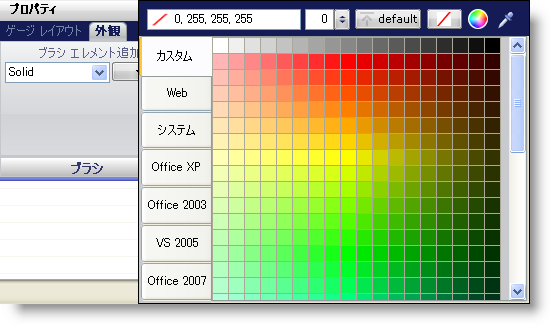
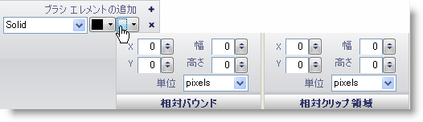

////
|metadata|
{
    "name": "wingauge-apply-the-solid-brush-element-using-the-gauge-designer",
    "controlName": ["WinGauge"],
    "tags": ["Charting","Design Environment"],
    "guid": "{1D1832C9-C1DE-4AFF-95A2-C15B207A2EE5}",
    "buildFlags": [],
    "createdOn": "0001-01-01T00:00:00Z"
}
|metadata|
////

= ゲージ デザイナを使用して単色ブラシ エレメントを適用

ゲージのプロパティを単色にするために、プロパティに単色ブラシ エレメントを適用します。

*ゲージ デザイナを使用して単色ブラシ エレメントをゲージのプロパティに適用するには、次の手順に従ってください。*

. ゲージ エクスプローラまたはインタラクティブなプレビュー領域で、単色ブラシ エレメントを適用したいプロパティを選択します。

. [プロパティ] パネルの [外観] タブで、[タイプ] ドロップダウン リストから [単色] を選択します。

. [詳細] ドロップダウン矢印をクリックします。

. カラー ピッカーが表示します。左側で、[Web] をクリックし、次に [黒] を選択します。
+

. 色の指定が終了したら、[ブラシ] ペインの任意の場所をクリックします。

. 相対バウンド エディタのドロップダウン矢印をクリックします。

. 表示される相対バウンド ペインで、次のプロパティを設定します。

** X - 0
** Y - 0
** 幅 - 0
** 高さ - 0

. 表示される相対クリップ領域で、次のプロパティを設定します。

** X - 0
** Y - 0
** 幅 - 0
** 高さ - 0

+

. インタラクティブ プレビュー領域で、ゲージのプロパティに適用された単色ブラシ エレメントが表示されます。

== 関連トピック

link:wingauge-solid-brush-element.html[単色ブラシ エレメント]

link:wingauge-apply-the-solid-fill-brush-element-at-design-time.html[デザインタイムに単色ブラシ エレメントを適用]

link:wingauge-apply-the-solid-brush-element-at-run-time.html[ランタイムに単色ブラシ エレメントを適用]