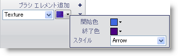

////

|metadata|
{
    "name": "wingauge-apply-the-texture-brush-element-using-the-gauge-designer",
    "controlName": ["WinGauge"],
    "tags": ["Charting","Design Environment"],
    "guid": "{358ABEDF-3098-4875-B6C7-63A29D70F68E}",  
    "buildFlags": [],
    "createdOn": "0001-01-01T00:00:00Z"
}
|metadata|
////

= ゲージ デザイナを使用してテクスチャ ブラシ エレメントを適用

テクスチャ ブラシ エレメントをゲージにプロパティに適用すると、キャンバスのようなテクスチャされたルック アンド フィールをプロパティに提供します。

*ゲージ デザイナを使用してテクスチャ ブラシ エレメントをゲージのプロパティに適用するには、次の手順に従ってください。*

[start=1]
. ゲージ エクスプローラまたはインタラクティブなプレビュー領域で、テクスチャ ブラシ エレメントを適用したいプロパティを選択します。
[start=2]
. [プロパティ] パネルの [外観] タブで、[タイプ] ドロップダウン リストから [テクスチャ] を選択します。
[start=3]
. [詳細] ドロップダウン矢印をクリックします。
[start=4]
. 表示した小さいウィンドウで、以下のプロパティを設定します。

** 背景色 - ドロップダウン矢印をクリックします。カラー ピッカーが表示します。左側で、[Web] をクリックし、次に [DimGray] を選択します。
** 前景色 - ドロップダウン矢印をクリックします。カラー ピッカーが表示します。左側で、[Web] をクリックし、次に [シルバー] を選択します。
** テクスチャ スタイル - ドロップダウン リストから、[キャンバス] を選択します。

[start=5]
. プロパティの指定が終了したら、[ブラシ] ペインの任意の場所をクリックします。
[start=6]
. インタラクティブなプレビュー領域で、ゲージのプロパティに適用されたテクスチャ ブラシ エレメントを確認できます。

== 関連トピック

link:wingauge-texture-brush-element.html[テクスチャ ブラシ エレメント]

link:wingauge-apply-the-texture-brush-element-at-design-time.html[デザインタイムにテクスチャ ブラシ エレメントを適用]

link:wingauge-apply-the-texture-brush-element-at-run-time.html[ランタイムにテクスチャ ブラシ エレメントを適用]