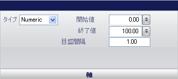

////
|metadata|
{
    "name": "wingauge-axis-pane",
    "controlName": ["WinGauge"],
    "tags": ["Layouts"],
    "guid": "{F7578D1B-9843-441E-90FB-A569E6CCBF40}",
    "buildFlags": [],
    "createdOn": "0001-01-01T00:00:00Z"
}
|metadata|
////

= 軸ペイン

[軸] ペインによって、Scale プロパティの軸の値を設定できます。

pick:[win-forms="link:{ApiPlatform}win.ultrawingauge{ApiVersion}~infragistics.ultragauge.resources.numericaxis.html[タイプ]"]  -- 軸を以下のいずれかのタイプに設定します。

* 数値 -- 軸の値を数値に設定します。
* 時間 -- 軸の値を日付フォーマットに設定すると、目盛の間隔が時間の長さになります。
* なし -- 軸が設定されていないことを示します。

pick:[win-forms="link:{ApiPlatform}win.ultrawingauge{ApiVersion}~infragistics.ultragauge.resources.numericaxis~startvalue.html[開始値]"]  -- この値を 0 から 360 の整数に設定します。この値はスケールの開始値を決定します。

pick:[win-forms="link:{ApiPlatform}win.ultrawingauge{ApiVersion}~infragistics.ultragauge.resources.numericaxis~endvalue.html[終了値]"]  -- この値を 0 から 360 の整数に設定します。この値はスケールの終了値を決定します。

pick:[win-forms="link:{ApiPlatform}win.ultrawingauge{ApiVersion}~infragistics.ultragauge.resources.numericaxis~tickmarkinterval.html[目盛の間隔]"]  -- この値を 0 から 100 の整数に設定します。この値は、スケールに表示される各主目盛の頻度を決定します。

== 関連トピック

link:wingauge-scale-layout-tab.html[スケール レイアウト タブ]