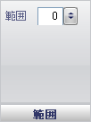

////

|metadata|
{
    "name": "wingauge-back-anchor-extent-pane",
    "controlName": ["WinGauge"],
    "tags": ["Charting"],
    "guid": "{2E7ED74F-ECE5-48CC-84FF-C9703E896D9C}",  
    "buildFlags": [],
    "createdOn": "0001-01-01T00:00:00Z"
}
|metadata|
////

= 範囲ペイン

[範囲] ペインによって、バック アンカーの位置を決定できます。

pick:[win-forms="link:{ApiPlatform}win.ultrawingauge{ApiVersion}~infragistics.ultragauge.resources.radialgaugeneedleanchor~extent.html[範囲]"]  -- この値を 0 から 100 の整数に設定します。範囲が 0 に設定されると、バック アンカーはラジアル ゲージの中央に配置されます。値が大きくなると、バック アンカーは針の方向でゲージの端に向けて移動します。値が小さくなると、バック アンカーは反対方向に移動します。100 よりも大きい値を入力すると、バック アンカーはゲージに表示されません。

== 関連トピック

link:wingauge-back-anchor-layout-tab.html[バック アンカー レイアウト タブ]