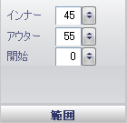

////

|metadata|
{
    "name": "wingauge-bar-marker-extent-pane",
    "controlName": ["WinGauge"],
    "tags": ["Charting"],
    "guid": "{5F3E44AF-BEBE-4B05-89B7-62C82FDF6B1F}",  
    "buildFlags": [],
    "createdOn": "0001-01-01T00:00:00Z"
}
|metadata|
////

= 範囲ペイン

[範囲] ペインは、バー マーカーの幅を決定します。

pick:[win-forms="link:{ApiPlatform}win.ultrawingauge{ApiVersion}~infragistics.ultragauge.resources.lineargaugebarmarker~innerextent.html[内側]"]  -- この値を 0 から 100 の整数に設定します。内側の値は、リニア ゲージの左側からバーの開始までの距離です。

pick:[win-forms="link:{ApiPlatform}win.ultrawingauge{ApiVersion}~infragistics.ultragauge.resources.lineargaugebarmarker~outerextent.html[外側]"]  -- この値を 0 から 100 の整数に設定します。外側の値は、リニア ゲージの左側からバーの終わりまでの距離です。

pick:[win-forms="link:{ApiPlatform}win.ultrawingauge{ApiVersion}~infragistics.ultragauge.resources.lineargaugebarmarker~startextent.html[開始]"]  -- この値を 0 から 100 の整数に設定します。開始値はバー マーカーの開始値です。

== 関連トピック

link:wingauge-bar-marker-layout-tab.html[バー マーカー レイアウト タブ]