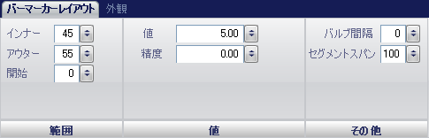
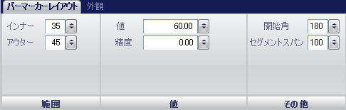

////

|metadata|
{
    "name": "wingauge-bar-marker-layout-tab",
    "controlName": ["WinGauge"],
    "tags": ["Charting"],
    "guid": "{9D5E4FE5-803A-4D00-84AA-C9502E2CCACF}",  
    "buildFlags": [],
    "createdOn": "0001-01-01T00:00:00Z"
}
|metadata|
////

= バー マーカー レイアウト タブ

Gauge コントロールの pick:[win-forms="link:{ApiPlatform}win.ultrawingauge{ApiVersion}~infragistics.ultragauge.resources.radialgaugebarmarker.html[Bar Marker]"]  プロパティは、リニア ゲージまたはラジアル ゲージのスケール上にある値を指し示すために使用されます。バー マーカーは、スケールの開始点と終了点を持つバーとして表示されます。たとえば、温度計を表すリニア ゲージを作成している場合には、水銀レベルを表示するためにバー マーカーを使用します。

[プロパティ] パネルの [バー マーカー レイアウト] タブを使用して、ゲージ上のバー マーカーをカスタマイズできます。ゲージ エクスプローラでバー マーカーをクリックする（[ゲージ] > [スケール] > [マーカー] > [バー マーカー]）、またはインタラクティブなプレビュー領域でゲージ上のバー マーカーをクリックするのいずれかによって、このタブにアクセスできます。

タブは以下の 3 つのペインに分割されています。

* link:wingauge-extent-pane.html[範囲]
* link:wingauge-value-pane.html[値]
* link:wingauge-misc-pane.html[その他]

以下のスクリーンショットは、リニア ゲージの [バー マーカー レイアウト] タブを示しています。

以下のスクリーンショットは、上記のスクリーンショットで指定された設定に基づいて作成されたバー マーカーを示しています。

image::images/Bar_Marker_Layout_Tab_02.png[]

ラジアル ゲージの [バー マーカー] プロパティは若干異なります。Blub Span プロパティはありませんが、代わりに Start Angle プロパティがあります。以下のスクリーンショットは、ラジアル ゲージの [バー マーカー レイアウト] タブを示しています。

以下のスクリーンショットは、上記のスクリーンショットで指定された設定に基づいて作成されたバー マーカーを示しています。

image::images/Bar_Marker_Layout_Tab_04.png[]