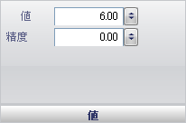

////

|metadata|
{
    "name": "wingauge-bar-marker-value-pane",
    "controlName": ["WinGauge"],
    "tags": ["Getting Started"],
    "guid": "{B7F93BF8-A8F0-4D05-9A5D-A930ADD6DB17}",  
    "buildFlags": [],
    "createdOn": "0001-01-01T00:00:00Z"
}
|metadata|
////

= 値ペイン

[値] ペインによって、バーがスケール上で停止する値を設定することができます。マーカーの「丸めの」数を指定することも可能です。

値 -- 項目の値を 0.00 から 100.00 の値に設定します。値はバーが停止するスケール上の点です。

精度 -- 項目の値を 0.00 から 100.00 の値に設定します。この値はマーカーの「丸めの」数です。たとえば、精度値が 0.5 に設定されると、バーの値は常に 0.5 の倍数にスナップします。

== 関連トピック

link:wingauge-bar-marker-layout-tab.html[バー マーカー レイアウト タブ]