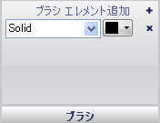

////

|metadata|
{
    "name": "wingauge-brush-pane",
    "controlName": ["WinGauge"],
    "tags": ["Charting"],
    "guid": "{DCC95DEF-81DE-4924-A2BC-C455CE98CCC7}",  
    "buildFlags": [],
    "createdOn": "0001-01-01T00:00:00Z"
}
|metadata|
////

= ブラシ ペイン

[ブラシ] ペインによってプロパティのブラシ タイプと色をカスタマイズできます。

pick:[win-forms="link:{ApiPlatform}win.ultrawingauge{ApiVersion}~infragistics.ultragauge.resources.labelappearance~brushelement.html[ブラシ タイプ]"]  -- このドロップダウン リストによって、プロパティのブラシ タイプを変更できます。

pick:[win-forms="link:{ApiPlatform}win.ultrawingauge{ApiVersion}~infragistics.ultragauge.resources.labelappearance~brushelement.html[ブラシの色]"]  -- 選択するブラシのタイプによって、ブラシの色のリストにそのブラシ タイプで使用可能な色が格納されます。

== 関連トピック

link:wingauge-appearance-tab.html[外観タブ]