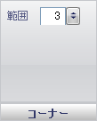

////

|metadata|
{
    "name": "wingauge-corners-pane",
    "controlName": ["WinGauge"],
    "tags": [],
    "guid": "{55FB8637-1A7A-4705-956F-27EBE2949668}",  
    "buildFlags": [],
    "createdOn": "0001-01-01T00:00:00Z"
}
|metadata|
////

= 角ペイン

[角] ペインは、リニア ゲージの角の形状を決定するために使用されます。

pick:[win-forms="link:{ApiPlatform}win.ultrawingauge{ApiVersion}~infragistics.ultragauge.resources.gauge~cornerextent.html[範囲]"]  -- この値を 0 から 100 の整数に設定します。範囲の値は、リニア ゲージの角の丸みを決定します。

== 関連トピック

link:wingauge-linear-gauge.html[リニア ゲージ]