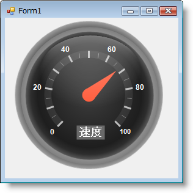
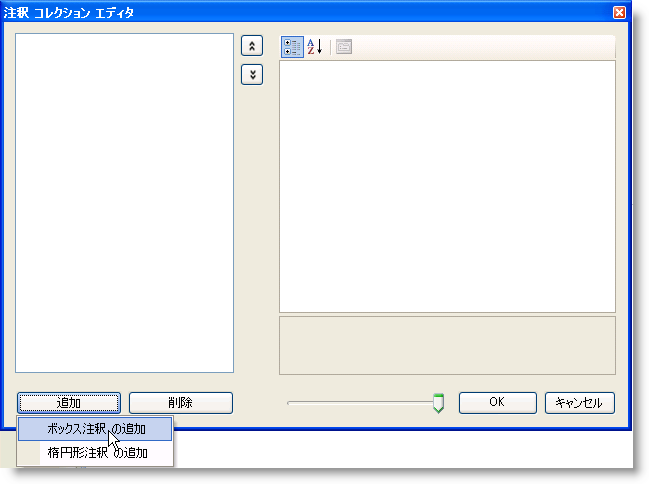

////

|metadata|
{
    "name": "wingauge-create-a-box-annotation-on-a-gauge",
    "controlName": ["WinGauge"],
    "tags": ["Charting"],
    "guid": "{D408B4A0-1FC5-4226-A219-CF40C4B33566}",  
    "buildFlags": [],
    "createdOn": "0001-01-01T00:00:00Z"
}
|metadata|
////

= ゲージでボックス注釈を作成

注釈は追加情報をゲージに追加するために役に立ちます。注釈をゲージに追加したい理由は多数あります。たとえば以下のとおりです。

* ゲージ上の特定の領域を強調表示する。
* エンド ユーザーがゲージ上のスケールを簡単に理解しやすくするための情報を追加する。スピードメーターを表すラジアル ゲージ上の「Mph」など。
* 「Infragistics' Fuel Gauge」などゲージに名前を追加する。

このトピックは、ゲージが作成済みであることを前提としています。ゲージを作成する方法については、pick:[win-forms="link:wingauge-getting-started-with-wingauge.html[「WinGauge で開始」]"] を参照してください。

以下の手順を完了した後でアプリケーションを保存および実行すると、ゲージは以下のゲージのようになります。

[[gaugeDesigner]]
*ゲージ デザイナを使用して既存のラジアル ゲージにボックス注釈を作成するには、次の手順に従ってください。*

[start=1]
. ゲージ エクスプローラで、[注釈] を展開します。
[start=2]
. [注釈の追加...] をクリックして、[新しいボックス注釈] を選択します。
[start=3]
. link:wingauge-properties-panel.html[[プロパティ] パネル]で、 link:wingauge-annotations-tab.html[[注釈] タブ]をクリックします。 link:wingauge-annotations-bounds-pane.html[[境界] ペイン]で、以下のプロパティを設定します。

** X -- 38
** Y -- 70
** 幅 -- 25
** 高さ -- 10
** 単位 -- パーセント

[start=4]
. [注釈] タブの link:wingauge-labels-pane.html[[ラベル] ペイン]で、以下のプロパティを設定します。

** フォーマット文字列 -- Speed

[start=5]
. link:wingauge-appearance-tab.html[[外観] タブ]をクリックします。 link:wingauge-brush-pane.html[[ブラシ] ペイン]で、以下のプロパティを設定します。

** タイプ -- 単色
** 色 -- グレー

[start=6]
. link:wingauge-labels-appearance-tab.html[[ラベル外観] タブ]をクリックします。 link:wingauge-brush-pane.html[[ブラシ] ペイン]で、以下のプロパティを設定します。

** タイプ -- 単色
** 色 -- 白

[start=7]
. [ラベル外観] タブの link:wingauge-font-pane.html[[フォント] ペイン]で、以下のプロパティを設定します。

** フォント -- Arial
** サイズ -- 14
** タイプ -- Point

*デザインタイムにゲージでボックス注釈を作成するには、次の手順に従ってください。*

[start=1]
. [プロパティ] ウィンドウで、pick:[win-forms="link:{ApiPlatform}win.ultrawingauge{ApiVersion}~infragistics.ultragauge.resources.gaugeannotation.html[Annotation]"]  プロパティをクリックします。次に省略記号（...）ボタンをクリックして、注釈コレクション エディタを開きます。
[start=2]
. 注釈コレクション エディタで、[追加] をクリックして、[ボックス注釈の追加] を選択します。

[start=3]
. 右側のペインで pick:[win-forms="link:{ApiPlatform}win.ultrawingauge{ApiVersion}~infragistics.ultragauge.resources.brushelement.html[BrushElement]"]  プロパティをクリックすることによって、新しい BrushElement オブジェクトを作成します。次にドロップダウン リストから、[単色塗りつぶし] を選択します。
[start=4]
. BrushElement プロパティを展開して、pick:[win-forms="link:{ApiPlatform}win.ultrawingauge{ApiVersion}~infragistics.ultragauge.resources.solidfillbrushelement~color.html[Color]"]  プロパティを Gray に設定します。
[start=5]
.pick:[win-forms="link:{ApiPlatform}win.ultrawingauge{ApiVersion}~infragistics.ultragauge.resources.boundedannotation~bounds.html[Bounds]"]  プロパティを展開して、注釈のサイズを調整し、ゲージ上に注釈を配置します。X プロパティを 38、Y プロパティを 70、[幅]プロパティを 25、[高さ] プロパティを 10、[単位] プロパティを [パーセント] に設定します。
[start=6]
. プロジェクトを実行すると、注釈は以下のフォームのいずれかに似たものになります。

image::images/Gauge_How_Do_I_Create_Annotations_02.png[]

[start=7]
. テキストを注釈に追加するには、pick:[win-forms="link:{ApiPlatform}win.ultrawingauge{ApiVersion}~infragistics.ultragauge.resources.radialgaugescale~labels.html[Label]"]  プロパティを展開します。
[start=8]
. BrushElement プロパティをクリックして、新しい BrushElement オブジェクトを作成します。次にドロップダウン リストから、[単色塗りつぶし] を選択します。
[start=9]
. BrushElement プロパティを展開し、Color プロパティを白に設定します。
[start=10]
. pick:[win-forms="link:{ApiPlatform}win.ultrawingauge{ApiVersion}~infragistics.ultragauge.resources.labelappearance~formatstring.html[FormatString]"]  プロパティを "Speed" に設定します。
[start=11]
. pick:[win-forms="link:{ApiPlatform}win.ultrawingauge{ApiVersion}~infragistics.ultragauge.resources.labelappearance~font.html[Font]"]  プロパティを展開します。
[start=12]
. [サイズ] を 14、[名前] を Arial に設定します。

[[runTime]]
*ランタイムにラベルをスケールに追加するには、次の手順に従ってください。*

[start=1]
. コードの記述を開始する前にコード ビハインドに using/Imports のディレクティブを配置します。そうすれば、メンバは完全に記述された名前を常にタイプする必要がなくなります。

*Visual Basic の場合：*

----
Imports Infragistics.UltraGauge.Resources
----

*C# の場合：*

----
using Infragistics.UltraGauge.Resources;
----

[start=2]
. Load イベントを作成します。
[start=3]
. クラスのインスタンスを作成します。

*Visual Basic の場合：*

----
Dim boxAnnotation1 As New BoxAnnotation()
Dim solidFillBrushElement1 As New SolidFillBrushElement()
Dim solidFillBrushElement2 As New SolidFillBrushElement()
----

*C# の場合：*

----
BoxAnnotation boxAnnotation1 = new BoxAnnotation();
SolidFillBrushElement solidFillBrushElement1 = new SolidFillBrushElement();
SolidFillBrushElement solidFillBrushElement2 = new SolidFillBrushElement();
----

[start=4]
. 以下の Bound プロパティを設定します。

** X -- 38
** Y -- 70
** 幅 -- 25
** 高さ -- 10
** 単位 -- パーセント

*Visual Basic の場合：*

----
boxAnnotation1.Bounds = New System.Drawing.Rectangle(38, 70, 25, 10)
boxAnnotation1.BoundsMeasure = Infragistics.UltraGauge.Resources.Measure.Percent
----

*C# の場合：*

----
boxAnnotation1.Bounds = new System.Drawing.Rectangle(38, 70, 25, 10);
boxAnnotation1.BoundsMeasure = Infragistics.UltraGauge.Resources.Measure.Percent;
----

[start=5]
. 以下の注釈の色のプロパティを設定します。

** タイプ -- 単色
** 色 -- グレー

*Visual Basic の場合：*

----
solidFillBrushElement1.Color = System.Drawing.Color.Gray
boxAnnotation1.BrushElement = solidFillBrushElement1
----

*C# の場合：*

----
solidFillBrushElement1.Color = System.Drawing.Color.Gray;
boxAnnotation1.BrushElement = solidFillBrushElement1;
----

[start=6]
. 以下のフォントの色のプロパティを設定します。

** タイプ -- 単色
** 色 -- 白

*Visual Basic の場合：*

----
solidFillBrushElement2.Color = System.Drawing.Color.White
boxAnnotation1.Label.BrushElement = solidFillBrushElement2
----

*C# の場合：*

----
solidFillBrushElement2.Color = System.Drawing.Color.White;
boxAnnotation1.Label.BrushElement = solidFillBrushElement2;
----

[start=7]
. 以下のフォントのプロパティを設定します。

** フォント -- Arial
** サイズ -- 14
** タイプ -- Point

*Visual Basic の場合：*

----
boxAnnotation1.Label.Font = New System.Drawing.Font("Arial", 14.0F)
----

*C# の場合：*

----
boxAnnotation1.Label.Font = new System.Drawing.Font("Arial", 14F);
----

[start=8]
. 以下の Format string を Speed に設定します。

*Visual Basic の場合：*

----
boxAnnotation1.Label.FormatString = "Speed"
----

*C# の場合：*

----
boxAnnotation1.Label.FormatString = "Speed";
----

[start=9]
. 注釈をゲージに追加します。

*Visual Basic の場合：*

----
me.UltraGauge1.Annotations.Add(boxAnnotation1)
----

*C# の場合：*

----
this.ultraGauge1.Annotations.Add(boxAnnotation1);
----