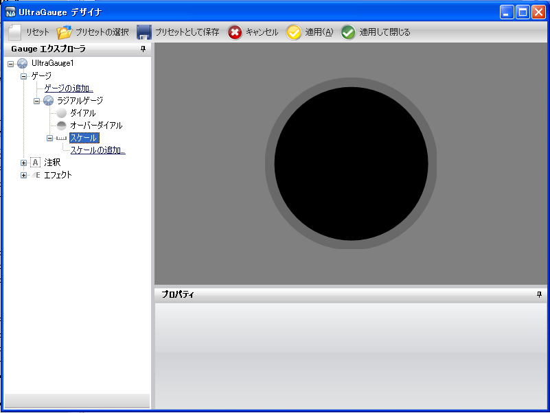
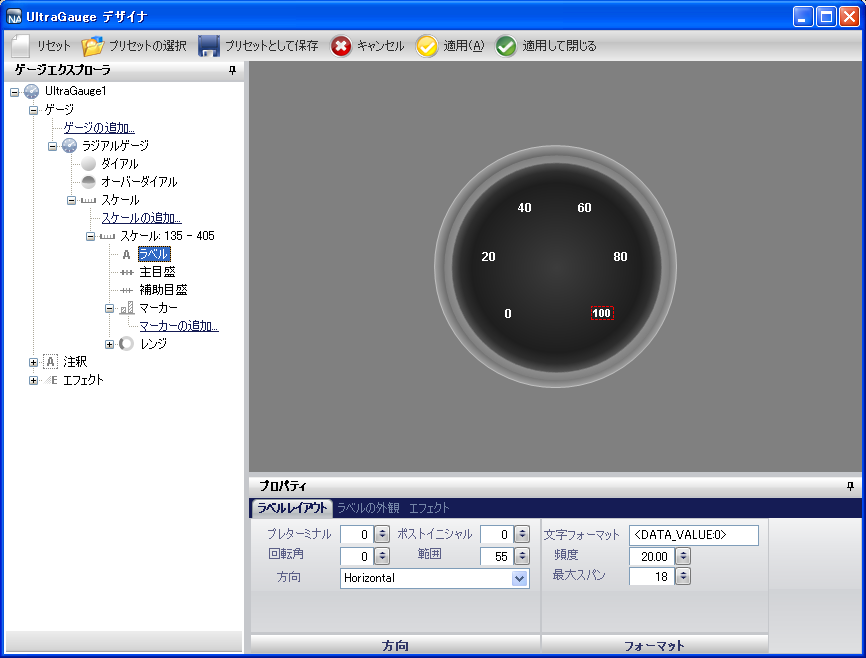
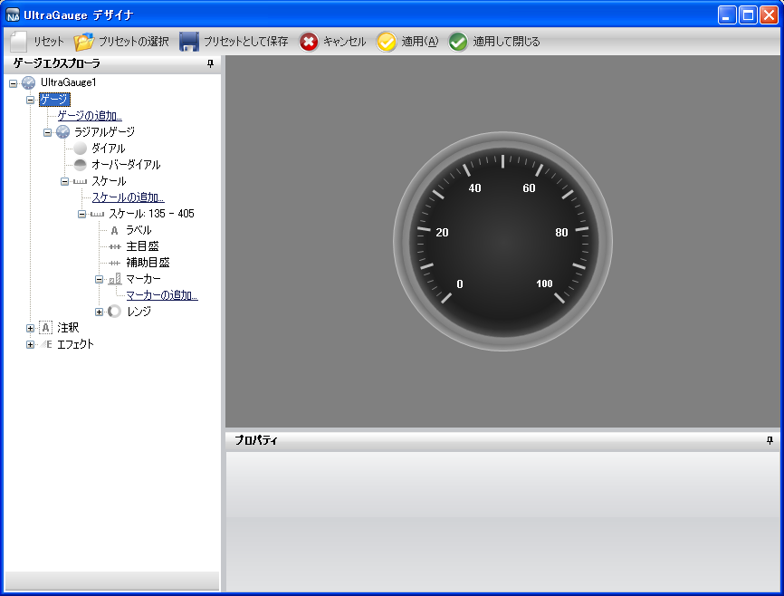
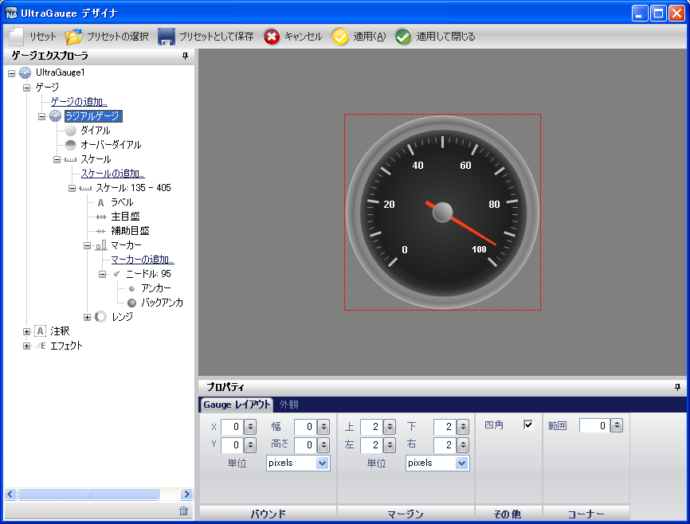

////

|metadata|
{
    "name": "wingauge-creating-a-basic-gauge-using-the-gauge-designer",
    "controlName": ["WinGauge"],
    "tags": [],
    "guid": "{43C10463-E7A5-4E38-BF4F-B5B692FE50D8}",  
    "buildFlags": [],
    "createdOn": "0001-01-01T00:00:00Z"
}
|metadata|
////

= ゲージ デザイナを使用して基本的なゲージを作成

== 始める前に

ゲージ デザイナを使用してラジアル ゲージを作成すると以下が可能になります。

* ゲージをプリセットとして保存して、将来のアプリケーションのために使用することができる。
* インタラクティブなプレビュー領域でゲージが作成されているときにゲージを確認することができる。
* ゲージのプロパティの編集プロセスを簡略化できる。

== 達成すること

ゲージ デザイナを使用して基本的なラジアル ゲージを作成することによって、ゲージ デザイナの基本を理解できます。

== 次の手順を実行します

[start=1]
. ツールボックスから、UltraGauge コントロールをフォームにドラッグします。ゲージ デザイナが開きます。

image::images/Gauge_Creating_a_Radial_Gauge_Using_the_Gauge_Designer_01.png[]

[start=2]
. ゲージ エクスプローラで、[ゲージ] を展開します。
[start=3]
. [ゲージの追加...] をクリックして、[新しいラジアル ゲージ] を選択します。
[start=4]
. [ラジアル ゲージ] を展開して、[目盛盤] を選択します。
[start=5]
. link:wingauge-properties-panel.html[[プロパティ] パネル]で、 link:wingauge-appearance-tab.html[[外観] タブ]をクリックします。 link:wingauge-brush-pane.html[[ブラシ] ペイン]で、プロパティを以下のとおり指定したブラシ エレメントを追加します。

** link:wingauge-apply-the-multi-stop-radial-gradient-brush-element-using-the-gauge-designer.html[マルチストップ放射型グラデーション ブラシ エレメント]

*** 開始色 -- 161, 161, 161
*** カラー ストップ -- 96, 96, 96
*** カラー ストップ オフセット -- 0.4758621
*** 終了色 -- 89, 89, 89

** link:wingauge-apply-the-solid-brush-element-using-the-gauge-designer.html[単色ブラシ エレメント]

*** 色 -- グレー

** link:wingauge-apply-the-multi-stop-radial-gradient-brush-element-using-the-gauge-designer.html[マルチストップ放射型グラデーション ブラシ エレメント]

*** 開始色 -- 透明
*** カラー ストップ -- 141, 141, 141
*** カラー ストップ オフセット -- 0.06206897
*** カラー ストップ -- 82, 82, 82
*** カラー ストップ オフセット -- 0.07586207
*** カラー ストップ -- 45, 45, 45
*** カラー ストップ オフセット -- 0.1448276
*** カラー ストップ -- 30, 30, 30
*** カラー ストップ オフセット -- 0.2448276
*** 終了色 -- 60, 60, 60

[start=6]
. [外観] タブの link:wingauge-stroke-pane.html[[ストローク] ペイン]で、以下のプロパティを設定します。

** タイプ -- 単色
** 詳細 -- シルバー
** スタイル -- 単色
** 太さ -- 1
** 配置 -- 中央

[start=7]
. ゲージ エクスプローラで、[スケール] を展開します。
[start=8]
. [スケールの追加...] をクリックして、[新しいスケール] を選択します。
[start=9]
. [プロパティ] パネルで、 link:wingauge-scale-layout-tab.html[[スケール レイアウト] タブ]をクリックします。 link:wingauge-sweep-angle-pane.html[[スイープ角度] ペイン]で、以下のプロパティを設定します。

** 開始 -- 135
** 終了 -- 405

[start=10]
. [スケール レイアウト] タブの link:wingauge-axis-pane.html[[軸] ペイン]をクリックして、[終了値] を 100.00 に設定します。
[start=11]
. ゲージ エクスプローラで、新しく作成したスケールを展開して、[ラベル] を選択します。
[start=12]
. [プロパティ] パネルで、 link:wingauge-labels-layout-tab.html[[ラベル レイアウト] タブ]をクリックします。 link:wingauge-orientation-pane.html[[方向] ペイン]で、以下のプロパティを設定します。

** 範囲 -- 55
** 方向 -- 外側

[start=13]
. [ラベル レイアウト] タブの link:wingauge-formatting-pane.html[[フォーマッティング] ペイン]をクリックして、以下のプロパティを設定します。

** 頻度 -- 20.00
** スパン最大 -- 18

[start=14]
. [ラベル外観] タブをクリックします。[ブラシ] ペインで、以下のプロパティを設定します。

** タイプ -- 単色
** 色 -- 白

[start=15]
. [ラベル外観] タブの link:wingauge-font-pane.html[[フォント] ペイン]をクリックして、以下のプロパティを設定します。

** フォント サイズ -- 12
** タイプ -- ピクセル
** スタイル -- 太字

[start=16]
. ゲージ エクスプローラで、[主目盛] を展開します。
[start=17]
. [プロパティ] パネルで、 link:wingauge-tickmark-layout-tab.html[[目盛レイアウト] タブ]をクリックします。 link:wingauge-tickmark-extent-pane.html[[範囲] ペイン]で、以下のプロパティを設定します。

** 開始 -- 67
** 終了 -- 79

[start=18]
. [目盛レイアウト] タブの link:wingauge-widths-pane.html[[幅] ペイン]をクリックして、以下のプロパティを設定します。

** 開始 -- 3
** 終了 -- 3

[start=19]
. [目盛レイアウト] タブの link:wingauge-tickmark-orientation-pane.html[[方向] ペイン]をクリックして、以下のプロパティを設定します。

** 頻度 -- 10.00

[start=20]
. [外観] タブをクリックします。[ブラシ] ペインで、以下のプロパティを設定します。

** タイプ -- 単色
** 色 -- 189, 189, 189

[start=21]
. ゲージ エクスプローラで、[副目盛] を選択します。
[start=22]
. [プロパティ] パネルで、[目盛レイアウト] タブをクリックします。[範囲] ペインで、以下のプロパティを設定します。

** 開始 -- 73
** 終了 -- 78

[start=23]
. [目盛レイアウト] タブの [幅] ペインで、以下のプロパティを設定します。

** 開始 -- 1
** 終了 -- 1

[start=24]
. [目盛レイアウト] タブの [方向] ペインで、以下のプロパティを設定します。

** 頻度 -- 2.00

[start=25]
. [外観] タブをクリックします。[ブラシ] ペインで、以下のプロパティを設定します。

** タイプ -- 単色
** 色 -- 240, 240, 240

[start=26]
. [外観] タブの [ストローク] ペインで、以下のプロパティを設定します。

** タイプ -- 単色
** 色 -- 135, 135, 135

[start=27]
. ゲージ エクスプローラで、[マーカー] を展開します。
[start=28]
. [マーカーの追加...] をクリックして、[新しい針] を選択します。
[start=29]
. [プロパティ] パネルで、 link:wingauge-needle-marker-layout-tab.html[[針マーカー レイアウト] タブ]をクリックします。 link:wingauge-widths-and-extents-pane.html[[幅と範囲] ペイン]で、以下のプロパティを設定します。

** 幅

*** 開始 -- 3
*** 中間 -- 3
*** 終了 -- 1

** 範囲

*** 開始 -- -20
*** 中間 -- 0
*** 終了 -- 65

[start=30]
. [針マーカー レイアウト] タブの link:wingauge-value-and-units.html[[値と単位] ペイン]で、以下のプロパティを設定します。

** 値 -- 95.00
** 精度 -- 1.00
** 単位 -- パーセント

[start=31]
. [外観] タブをクリックします。[ブラシ] ペインで、以下のプロパティを設定します。

** タイプ -- 単色
** 色 -- 255, 61, 22

[start=32]
. ゲージ エクスプローラで、新しく作成した針マーカーを展開して、[アンカー] を選択します。
[start=33]
. [プロパティ] パネルで、[外観] タブをクリックします。[ブラシ] ペインで、以下のプロパティを設定します。

** タイプ -- SimpleGradient
** 開始色 -- Gainsboro
** 終了色 -- 64, 64, 64
** グラデーション スタイル -- BackwardDiagonal

[start=34]
. [外観] タブの [ストローク] ペインで、以下のプロパティを設定します。

** タイプ -- RadialGradient
** 周囲の色 -- グレー
** 中央の色 -- WhiteSmoke
** フォーカス スケール -- 0,0
** 中心点 -- 75, 25

[start=35]
. これでゲージ デザイナを使用して、基本的なラジアル ゲージの作成に成功しました。ゲージは、以下のスクリーンショットのゲージのようになります。

== 関連トピック

link:wingauge-creating-a-complex-gauge-using-the-gauge-designer.html[ゲージ デザイナを使用して複雑なゲージを作成]