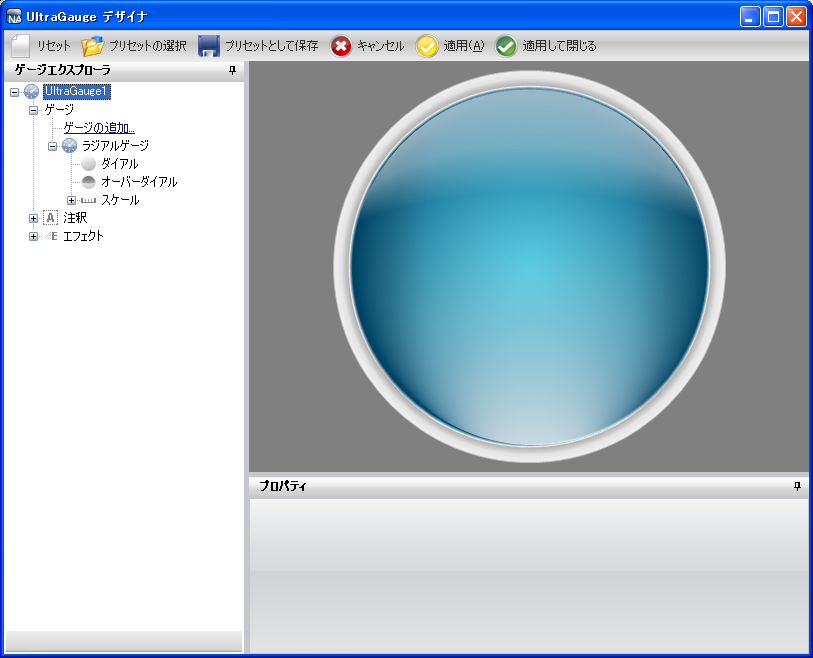
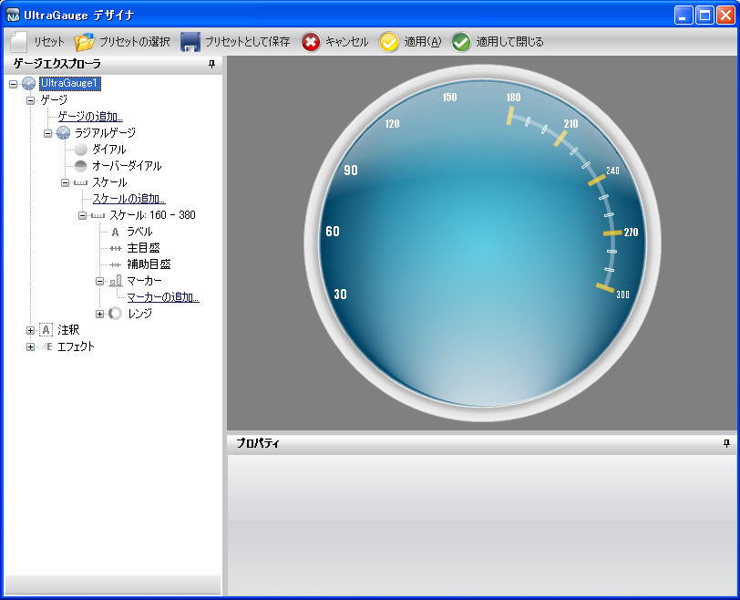
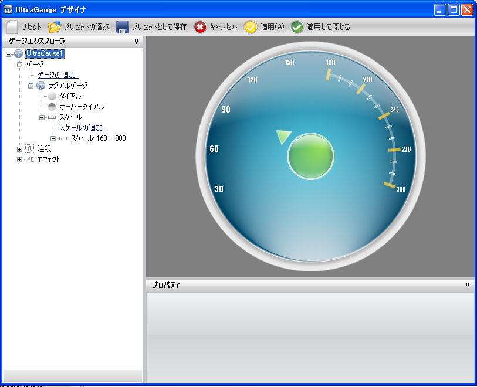

////

|metadata|
{
    "name": "wingauge-creating-a-complex-gauge-using-the-gauge-designer-part-1-of-5",
    "controlName": ["WinGauge"],
    "tags": [],
    "guid": "{66293F67-9E21-46EE-89C7-7C3C3E34169C}",  
    "buildFlags": [],
    "createdOn": "0001-01-01T00:00:00Z"
}
|metadata|
////

= ゲージ デザイナを使用して複雑なゲージを作成（1/5）

この手順は、ラジアル ゲージを作成して、Dial、Scale および Label プロパティを設定するプロセスを説明します。

[start=1]
. ツールボックスから、UltraGauge コントロールをフォームにドラッグします。ゲージ デザイナが開きます。

image::images/Gauge_Creating_a_Radial_Gauge_Using_the_Gauge_Designer_01.png[]

[start=2]
. ゲージ エクスプローラで、[ゲージ] を展開します。
[start=3]
. [ゲージの追加...] をクリックして、[新しいラジアル ゲージ] を選択します。
[start=4]
. [ラジアル ゲージ] を展開して、[OverDial] を選択します。
[start=5]
. link:wingauge-properties-panel.html[[プロパティ] パネル]で、 link:wingauge-appearance-tab.html[[外観] タブ]をクリックします。 link:wingauge-brush-pane.html[[ブラシ] ペイン]で、プロパティを以下のとおり指定したブラシ エレメントを追加します。

** link:wingauge-apply-the-multi-stop-radial-gradient-brush-element-using-the-gauge-designer.html[マルチストップ放射型グラデーション ブラシ エレメント]

*** カラー ストップ 1 -- Offset = 0, Color = 透明
*** カラー ストップ 2 -- Offset = 0.005045409, Color = Color.FromArgb(150, 255, 255, 255)
*** カラー ストップ 3 -- Offset = 0.1413793, Color = Color.FromArgb(100, 255, 255, 255)
*** カラー ストップ 4 -- Offset = 0.2689655, Color = Transparent
*** カラー ストップ 5 -- Offset = 1, Color = Transparent
*** フォーカス スケール -- 3, 0
*** 中心点 -- 50, 100

** マルチストップ放射型グラデーション ブラシ エレメント

*** カラー ストップ 1 -- Offset = 0, Color = Transparent
*** カラー ストップ 2 -- Offset = 0.2517241, Color = Color.FromArgb(46, 254, 254, 254)
*** カラー ストップ 3 -- Offset = 0.6034483, Color = Color.FromArgb(120, 255, 255, 255)
*** カラー ストップ 4 -- Offset = 1, Color = Color.FromArgb(255, 255, 255, 255)
*** フォーカス スケール -- 0.099999, 0
*** 中心点 -- 50, 110

[start=6]
. [ラジアル ゲージ] を展開して、[目盛盤] を選択します。
[start=7]
. [プロパティ] パネルで、[外観] タブをクリックします。[ブラシ] ペインで、プロパティを以下のとおり指定したブラシ エレメントを追加します。

** マルチストップ放射型グラデーション ブラシ エレメント

*** カラー ストップ 1 -- Offset = 0, Color = Color.FromArgb(240, 240, 240)
*** カラー ストップ 2 -- Offset = 0.4758621, Color = Color.FromArgb(210, 210, 210)
*** カラー ストップ 3 -- Offset = 1, Color = Color.FromArgb(89, 89, 89)
*** フォーカス スケール -- 0.800000012, 0.800000012
*** 中心点 -- 50, 50

** マルチストップ放射型グラデーション ブラシ エレメント

*** カラー ストップ 1 -- Offset = 0, Color = Transparent
*** カラー ストップ 2 -- Offset = 0.003548387, Color = Color.FromArgb(180, 180, 180)
*** カラー ストップ 3 -- Offset = 0.04193548, Color = Color.FromArgb(240, 240, 240)
*** カラー ストップ 4 -- Offset = 0.05870968, Color = Color.FromArgb(0, 79, 118)
*** カラー ストップ 5 -- Offset = 1, Color = Color.FromArgb(0, 174, 209)
*** フォーカス スケール -- 0, 0
*** 中心点 -- 50, 50

** マルチストップ放射型グラデーション ブラシ エレメント

*** カラー ストップ 1 -- Offset = 0, Color = Transparent
*** カラー ストップ 2 -- Offset = 0.02413793, Color = Color.FromArgb(40, 0, 0, 0)
*** カラー ストップ 3 -- Offset = 0.2655172, Color = Color.FromArgb(30, 0, 0, 0)
*** カラー ストップ 4 -- Offset = 0.4551724, Color = Transparent
*** カラー ストップ 5 -- Offset = 1, Color = Transparent
*** フォーカス スケール -- 0.5, 3
*** 中心点 -- 100, 50

** マルチストップ放射型グラデーション ブラシ エレメント

*** カラー ストップ 1 -- Offset = 0, Color = Transparent
*** カラー ストップ 2 -- Offset = 0.02413793, Color = Color.FromArgb(40, 0, 0, 0)
*** カラー ストップ 3 -- Offset = 0.2655172, Color = Color.FromArgb(30, 0, 0, 0)
*** カラー ストップ 4 -- Offset = 0.4551724, Color = Transparent
*** カラー ストップ 5 -- Offset = 1, Color = Transparent
*** フォーカス スケール -- 0.5, 3
*** 中心点 -- 0, 50

[start=8]
. [外観] タブの link:wingauge-stroke-pane.html[[ストローク] ペイン]で、以下のプロパティを設定します。

** タイプ -- 単色
** 詳細 -- シルバー
** スタイル -- 単色
** 太さ -- 1
** 配置 -- 中央

[start=9]
. ゲージ エクスプローラで、[スケール] を展開します。
[start=10]
. [スケールの追加...] をクリックして、[新しいスケール] を選択します。
[start=11]
. [プロパティ] パネルで、 link:wingauge-scale-layout-tab.html[[スケール レイアウト] タブ]をクリックします。 link:wingauge-sweep-angle-pane.html[[スイープ角度] ペイン]で、以下のプロパティを設定します。

** 開始 -- 160
** 終了 -- 380

[start=12]
. [スケール レイアウト] タブの link:wingauge-axis-pane.html[[軸] ペイン]で、以下のプロパティを設定します。

** 終了値 -- 300.00
** 開始値 -- 30.00
** 目盛間隔 -- 1.0

[start=13]
. ゲージ エクスプローラで、新しく作成したスケールを展開して、[ラベル] を選択します。
[start=14]
. [プロパティ] パネルで、 link:wingauge-labels-layout-tab.html[[ラベル レイアウト] タブ]をクリックします。 link:wingauge-orientation-pane.html[[方向] ペイン]で、以下のプロパティを設定します。

** 範囲 -- 84
** 方向 -- 水平

[start=15]
. [ラベル レイアウト] タブの link:wingauge-formatting-pane.html[[フォーマッティング] ペイン]で、以下のプロパティを設定します。

** 頻度 -- 30.00
** スパン最大 -- 10

[start=16]
. link:wingauge-labels-appearance-tab.html[[ラベル外観] タブ]をクリックします。[ブラシ] ペインで、以下のプロパティを設定します。

** タイプ -- 単色
** 色 -- 白

[start=17]
. [ラベル外観] タブの link:wingauge-font-pane.html[[フォント] ペイン]で、以下のプロパティを設定します。

** フォント -- Impact
** フォント サイズ -- 14
** タイプ -- Point

[start=18]
. ゲージ エクスプローラで、[主目盛] を展開します。
[start=19]
. [プロパティ] パネルで、 link:wingauge-tickmark-layout-tab.html[[目盛レイアウト] タブ]をクリックします。 link:wingauge-tickmark-extent-pane.html[[範囲] ペイン]で、以下のプロパティを設定します。

** 開始 -- 68
** 終了 -- 78

[start=20]
. [目盛レイアウト] タブの link:wingauge-widths-pane.html[[幅] ペイン]で、以下のプロパティを設定します。

** 開始 -- 4
** 終了 -- 4

[start=21]
. [目盛レイアウト] タブの link:wingauge-tickmark-orientation-pane.html[[方向] ペイン]で、以下のプロパティを設定します。

** 頻度 -- 30.00
** ポストイニシャル -- 150

[start=22]
. [外観] タブをクリックします。[ブラシ] ペインで、以下のプロパティを設定します。

** タイプ -- 単色
** 色 -- Color.FromArgb(180, 255, 216, 22)

[start=23]
. [外観] タブの [ストローク] ペインで、以下のプロパティを設定します。

** タイプ -- 単色
** 色 -- Color.FromArgb(232, 154, 0)

[start=24]
. ゲージ エクスプローラで、[副目盛] を選択します。
[start=25]
. [プロパティ] パネルで、[目盛レイアウト] タブをクリックします。[範囲] ペインで、以下のプロパティを設定します。

** 開始 -- 70
** 終了 -- 75

[start=26]
. [目盛レイアウト] タブの [幅] ペインで、以下のプロパティを設定します。

** 開始 -- 2
** 終了 -- 2

[start=27]
. [目盛レイアウト] タブの [方向] ペインで、以下のプロパティを設定します。

** ポストイニシャル -- 150
** 頻度 -- 10.00

[start=28]
. [外観] タブをクリックします。[ブラシ] ペインで、以下のプロパティを設定します。

** タイプ -- 単色
** 色 -- Color.FromArgb(0, 255, 255, 255)

[start=29]
. [外観] タブの [ストローク] ペインで、以下のプロパティを設定します。

** タイプ -- 単色
** 色 -- 白

[start=30]
. ゲージ エクスプローラで、[マーカー] を展開します。
[start=31]
. [マーカーの追加...] をクリックして、[新しい針] を選択します。
[start=32]
. [プロパティ] パネルで、 link:wingauge-needle-marker-layout-tab.html[[針マーカー レイアウト] タブ]をクリックします。 link:wingauge-widths-and-extents-pane.html[[幅と範囲] ペイン]で、以下のプロパティを設定します。

** 幅

*** 開始 -- 7
*** 中間 -- 7
*** 終了 -- 0

** 範囲

*** 開始 -- -26
*** 中間 -- 26
*** 終了 -- 37

[start=33]
. [針マーカー レイアウト] タブの link:wingauge-value-and-units.html[[値と単位] ペイン]で、以下のプロパティを設定します。

** 値 -- 100.00
** 精度 -- 100.00
** 単位 -- パーセント

[start=34]
. [外観] タブをクリックします。[ブラシ] ペインで、プロパティを以下のとおり指定したブラシ エレメントを追加します。

** link:wingauge-simple-gradient-brush-element.html[シンプル グラデーション ブラシ エレメント]

*** 開始色 -- Color = Color.FromArgb(230, 255, 181)
*** 終了色 -- Color = Color.FromArgb(180, 69, 209, 0)
*** グラデーション スタイル -- BackwardDiagonal

[start=35]
. [外観] タブの [ストローク] ペインで、以下のプロパティを設定します。

** タイプ -- 単色
** 色 -- Color.FromArgb(125, 255, 255, 255)
** 太さ -- 2

[start=36]
. ゲージ エクスプローラで、新しく作成した針マーカーを展開して、[アンカー] を選択します。
[start=37]
. link:wingauge-back-anchor-layout-tab.html[[アンカー レイアウト] タブ]の link:wingauge-radius-pane.html[[半径] ペイン]で、以下のプロパティを設定します。

** 値 -- 20

[start=38]
. [プロパティ] パネルで、[外観] タブをクリックします。[ブラシ] ペインで、プロパティを以下のとおり指定したブラシ エレメントを追加します。

** マルチストップ放射型グラデーション ブラシ エレメント

*** カラー ストップ 1 -- Offset = 0, Color = Color.FromArgb(0, 141, 47)
*** カラー ストップ 2 -- Offset = 1, Color = Color.FromArgb(104, 209, 0)
*** フォーカス スケール -- 0, 0
*** 中心点 -- 75, 25

** マルチストップ放射型グラデーション ブラシ エレメント

*** カラー ストップ 1 -- Offset = 0, Color = Transparent
*** カラー ストップ 2 -- Offset = 0.02901786, Color = Color.FromArgb(80, 0, 0, 0)
*** カラー ストップ 3 -- Offset = 0.1241379, Color = Transparent
*** カラー ストップ 4 -- Offset = 1, Color = Transparent
*** フォーカス スケール -- 0, 3
*** 中心点 -- 100, 50

** マルチストップ放射型グラデーション ブラシ エレメント

*** カラー ストップ 1 -- Offset = 0, Color = Transparent
*** カラー ストップ 2 -- Offset = 0.02901786, Color = Color.FromArgb(80, 0, 0, 0)
*** カラー ストップ 3 -- Offset = 0.1241379, Color = Transparent
*** カラー ストップ 4 -- Offset = 1, Color = Transparent
*** フォーカス スケール -- 0, 3
*** 中心点 -- 0, 50

** マルチストップ放射型グラデーション ブラシ エレメント

*** カラー ストップ 1 -- Offset = 0, Color = Transparent
*** カラー ストップ 2 -- Offset = 0.02758621, Color = Color.FromArgb(200, 255, 255, 255)
*** カラー ストップ 3 -- Offset = 0.3034483, Color = Color.FromArgb(0, 0, 0, 0)
*** カラー ストップ 4 -- Offset = 0.3724138, Color = Transparent
*** カラー ストップ 5 -- Offset = 1, Color = Transparent
*** フォーカス スケール -- 3, 0
*** 中心点 -- 50, 100

** マルチストップ放射型グラデーション ブラシ エレメント

*** カラー ストップ 1 -- Offset = 0, Color = Transparent
*** カラー ストップ 2 -- Offset = 0.03103448, Color = Color.FromArgb(71, 255, 255, 255)
*** カラー ストップ 3 -- Offset = 0.162069, Color = Transparent
*** カラー ストップ 4 -- Offset = 0.3724138, Color = Transparent
*** カラー ストップ 5 -- Offset = 1, Color = Transparent
*** フォーカス スケール -- 5, 0
*** 中心点 -- 50, 0

[start=39]
. [外観] タブの [ストローク] ペインで、以下のプロパティを設定します。

** link:wingauge-radial-gradient-brush-element.html[放射型グラデーション ブラシ エレメント]

*** 周囲の色 -- Color.FromArgb(180, 255, 255, 255)
*** 中央の色 -- Color.FromArgb(150, 255, 255, 255)
*** フォーカス スケール -- 0,0
*** 中心点 -- 75, 25

** 太さ -- 3

[start=40]
. ゲージ エクスプローラで、[レンジ] を展開します。
[start=41]
. [レンジの追加...] をクリックして、[新しいレンジ] を選択します。
[start=42]
. link:wingauge-range-layout-tab.html[[レンジ レイアウト] タブ]の link:wingauge-value-pane.html[[値] ペイン]で、以下のプロパティを設定します。

** 開始 -- 180.00
** 終了 -- 360.00

[start=43]
. [レンジ レイアウト] タブの link:wingauge-extent-pane.html[[範囲] ペイン]で、以下のプロパティを設定します。

** 内側の開始 -- 72
** 内側の終了 -- 72
** 外側 -- 74

[start=44]
. [プロパティ] パネルで、[外観] タブをクリックします。[ブラシ] ペインで、以下のプロパティを設定します。

** タイプ -- 単色
** 色 -- Color.FromArgb(80, 255, 255, 255)
** 太さ -- 1

== 関連トピック

link:wingauge-creating-a-complex-gauge-using-the-gauge-designer-part-2-of-5.html[ゲージ デザイナを使用して複雑なゲージを作成（2/5）]