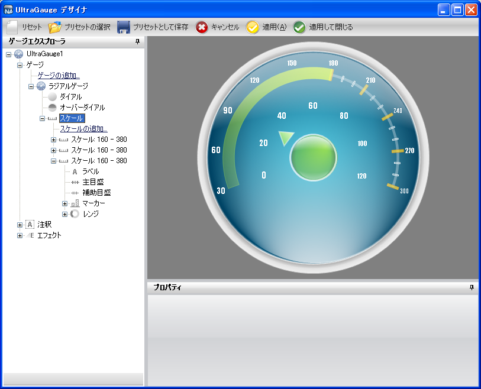
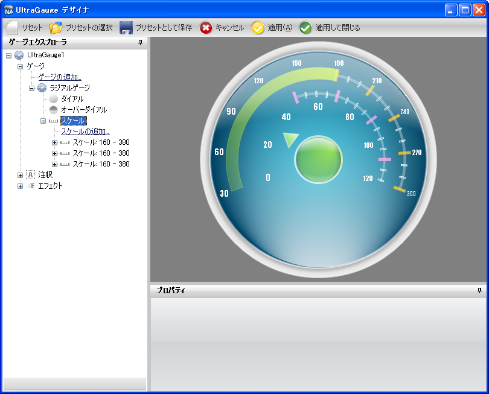

////

|metadata|
{
    "name": "wingauge-creating-a-complex-gauge-using-the-gauge-designer-part-3-of-5",
    "controlName": ["WinGauge"],
    "tags": ["Charting","Design Environment"],
    "guid": "{E874ECBD-0C6C-4E95-96AD-4653D64AB08D}",  
    "buildFlags": [],
    "createdOn": "0001-01-01T00:00:00Z"
}
|metadata|
////

= ゲージ デザイナを使用して複雑なゲージを作成（3/5）

このトピックは、 link:wingauge-creating-a-complex-gauge-using-the-gauge-designer-part-2-of-5.html[「ゲージ デザイナを使用して複雑なゲージを作成（2/5）」]の続きです。この手順は、新しいスケール、ラベル、目盛、レンジを既存のラジアル ゲージに追加するプロセスを説明します。

[start=1]
. ゲージ エクスプローラで、[スケール] を展開します。
[start=2]
. [スケールの追加...] をクリックして、[新しいスケール] を選択します。
[start=3]
. [プロパティ] パネルで、 link:wingauge-scale-layout-tab.html[[スケール レイアウト] タブ]をクリックします。 link:wingauge-sweep-angle-pane.html[[スイープ角度] ペイン]で、以下のプロパティを設定します。

** 開始 -- 160
** 終了 -- 380

[start=4]
. [スケール レイアウト] タブの link:wingauge-axis-pane.html[[軸] ペイン]で、以下のプロパティを設定します。

** 終了値 -- 120.00
** 開始値 -- 0.00
** 目盛間隔 -- 1.0

[start=5]
. ゲージ エクスプローラで、新しく作成したスケールを展開して、[ラベル] を選択します。
[start=6]
. [プロパティ] パネルで、 link:wingauge-labels-layout-tab.html[[ラベル レイアウト] タブ]をクリックします。 link:wingauge-orientation-pane.html[[方向] ペイン]で、以下のプロパティを設定します。

** 範囲 -- 45
** 方向 -- 水平

[start=7]
. [ラベル レイアウト] タブの link:wingauge-formatting-pane.html[[フォーマッティング] ペイン]で、以下のプロパティを設定します。

** 頻度 -- 20.00
** スパン最大 -- 10

[start=8]
. link:wingauge-labels-appearance-tab.html[[ラベル外観] タブ]をクリックします。 link:wingauge-brush-pane.html[[ブラシ] ペイン]で、以下のプロパティを設定します。

** タイプ -- 単色
** 色 -- 白

[start=9]
. [ラベル外観] タブの link:wingauge-font-pane.html[[フォント] ペイン]で、以下のプロパティを設定します。

** フォント -- Impact
** フォント サイズ -- 14
** タイプ -- Point

[start=10]
. ゲージ エクスプローラで、[主目盛] を展開します。
[start=11]
. [プロパティ] パネルで、 link:wingauge-tickmark-layout-tab.html[[目盛レイアウト] タブ]をクリックします。 link:wingauge-tickmark-extent-pane.html[[範囲] ペイン]で、以下のプロパティを設定します。

** 開始 -- 51
** 終了 -- 61

[start=12]
. [目盛レイアウト] タブの link:wingauge-widths-pane.html[[幅] ペイン]で、以下のプロパティを設定します。

** 開始 -- 4
** 終了 -- 4

[start=13]
. [目盛レイアウト] タブの link:wingauge-tickmark-orientation-pane.html[[方向] ペイン]で、以下のプロパティを設定します。

** 頻度 -- 20.00
** ポストイニシャル -- 49

[start=14]
. [外観] タブをクリックします。[ブラシ] ペインで、以下のプロパティを設定します。

** タイプ -- 単色
** 色 -- Color.FromArgb(180, 255, 158, 255)

[start=15]
. [外観] タブの link:wingauge-stroke-pane.html[[ストローク] ペイン]で、以下のプロパティを設定します。

** タイプ -- 単色
** 色 -- Color.FromArgb(255, 135, 215)

[start=16]
. ゲージ エクスプローラで、[副目盛] を選択します。
[start=17]
. [プロパティ] パネルで、[目盛レイアウト] タブをクリックします。[範囲] ペインで、以下のプロパティを設定します。

** 開始 -- 53
** 終了 -- 58

[start=18]
. [目盛レイアウト] タブの [幅] ペインで、以下のプロパティを設定します。

** 開始 -- 2
** 終了 -- 2

[start=19]
. [目盛レイアウト] タブの [方向] ペインで、以下のプロパティを設定します。

** ポストイニシャル -- 49
** 頻度 -- 5.00

[start=20]
. [外観] タブをクリックします。[ブラシ] ペインで、以下のプロパティを設定します。

** タイプ -- 単色
** 色 -- Color.FromArgb(0, 255, 255, 255)

[start=21]
. [外観] タブの [ストローク] ペインで、以下のプロパティを設定します。

** タイプ -- 単色
** 色 -- 白

[start=22]
. ゲージ エクスプローラで、[レンジ] を展開します。
[start=23]
. [レンジの追加...] をクリックして、[新しいレンジ] を選択します。
[start=24]
. link:wingauge-range-layout-tab.html[[レンジ レイアウト] タブ]の link:wingauge-value-pane.html[[値] ペイン]で、以下のプロパティを設定します。

** 開始 -- 50.00
** 終了 -- 120.00

[start=25]
. [レンジ レイアウト] タブの link:wingauge-extent-pane.html[[範囲] ペイン]で、以下のプロパティを設定します。

** 内側の開始 -- 55
** 内側の終了 -- 55
** 外側 -- 57

[start=26]
. [プロパティ] パネルで、[外観] タブをクリックします。[ブラシ] ペインで、以下のプロパティを設定します。

** タイプ -- 単色
** 色 -- Color.FromArgb(80, 255, 255, 255)
** 太さ -- 1

== 関連トピック

link:wingauge-creating-a-complex-gauge-using-the-gauge-designer-part-4-of-5.html[ゲージ デザイナを使用して複雑なゲージを作成（4/5）]