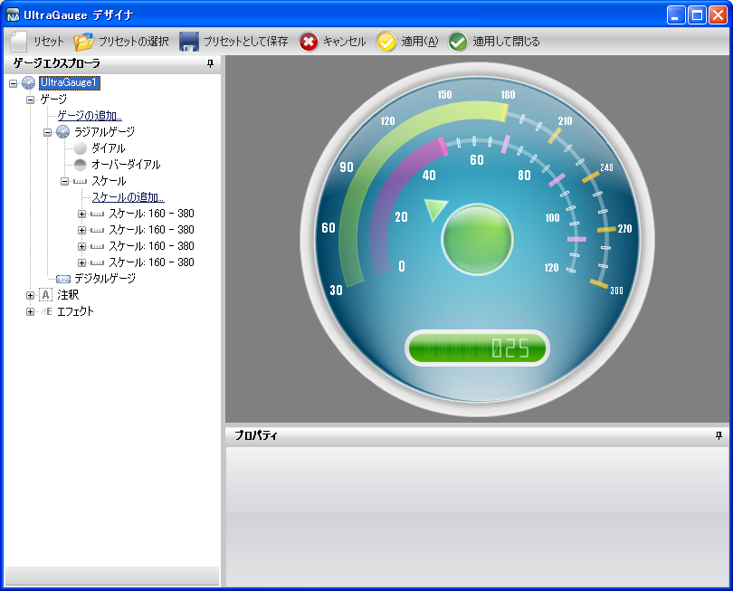

////

|metadata|
{
    "name": "wingauge-creating-a-complex-gauge-using-the-gauge-designer-part-5-of-5",
    "controlName": ["WinGauge"],
    "tags": ["Charting","Design Environment"],
    "guid": "{5EE9AE34-A362-4CF8-AAFB-C04686E1C05E}",  
    "buildFlags": [],
    "createdOn": "0001-01-01T00:00:00Z"
}
|metadata|
////

= ゲージ デザイナを使用して複雑なゲージを作成（5/5）

このトピックは、 link:wingauge-creating-a-complex-gauge-using-the-gauge-designer-part-4-of-5.html[「ゲージ デザイナを使用して複雑なゲージを作成（4/5）」]の続きです。この手順は、デジタル ゲージを既存のラジアル ゲージに追加するプロセスを説明します。

[start=1]
. ゲージ エクスプローラで、[ゲージ] を展開します。
[start=2]
. [ゲージの追加...] をクリックして、[新しいデジタル ゲージ] を選択します。
[start=3]
. [プロパティ] パネルで、 link:wingauge-digital-gauge.html[[ゲージ レイアウト] タブ]をクリックします。 link:wingauge-bounds-pane.html[[境界] ペイン]で、以下のプロパティを設定します。

** X -- 0
** Y -- 70
** 幅 -- 100
** 高さ -- 18
** 単位 -- パーセント

[start=4]
. [ゲージ レイアウト] タブの link:wingauge-margin-pane.html[[マージン] ペイン]で、以下のプロパティを設定します。

** 上 -- 15
** 下 -- 15
** 左 -- 100
** 右 -- 100
** 単位 -- ピクセル

[start=5]
. [ゲージ レイアウト] タブの link:wingauge-digital-misc-pane.html[[その他] ペイン]で、以下のプロパティを設定します。

** モード -- FourteenSegment
** テキスト -- 025
** 範囲 -- 48
** 数字 -- 8
** 数字のスペース -- 6

[start=6]
. [プロパティ] パネルで、 link:wingauge-appearance-tab.html[[外観] タブ]をクリックします。 link:wingauge-brush-pane.html[[ブラシ] ペイン]で、プロパティを以下のとおり指定したブラシ エレメントを追加します。

** link:wingauge-multi-stop-linear-gradient-brush-element.html[マルチストップ線形グラデーション ブラシ エレメント]

*** カラー ストップ 1 -- Offset = 0, Color = Color.FromArgb(93, 186, 0)
*** カラー ストップ 2 -- Offset = 0.5, Color = Color.FromArgb(23, 141, 0)
*** カラー ストップ 3 -- Offset = 1, Color = Color.FromArgb(93, 186, 0)
*** 角度 -- 90

** マルチストップ線形グラデーション ブラシ エレメント

*** カラー ストップ 1 -- Offset = 0, Color = Color.FromArgb(150, 255, 255, 255)
*** カラー ストップ 2 -- Offset = 0.2586207, Color = Color.FromArgb(125, 255, 255, 255)
*** カラー ストップ 3 -- Offset = 0.5103447, Color = Transparent
*** カラー ストップ 4 -- Offset = 1, Color = Transparent
*** 角度 -- 90

[start=7]
. [外観] タブの link:wingauge-stroke-pane.html[[ストローク] ペイン]で、以下のプロパティを設定します。

** シンプル グラデーション ブラシ エレメント

*** 開始色 -- WhiteSmoke
*** 終了色 -- Gainsboro
*** グラデーション スタイル -- Backward Diagonal

** 太さ -- 5

[start=8]
. link:wingauge-digit-appearance-tab.html[[数字外観] タブ]をクリックします。 link:wingauge-font-brush-pane.html[[フォント ブラシ] ペイン]で、以下のプロパティを設定します。

** タイプ -- 単色
** 色 -- Color.FromArgb(255, 255, 255)

[start=9]
. [数字外観] タブの link:wingauge-unlit-brush-pane.html[[アンリット ブラシ] ペイン]で、以下のプロパティを設定します。

** タイプ -- 単色
** 色 -- Color.FromArgb(30, 255, 255, 255)

