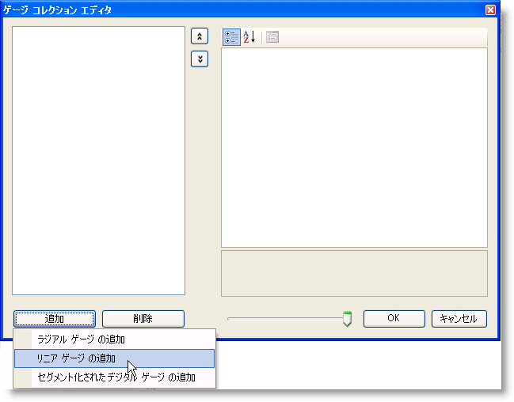
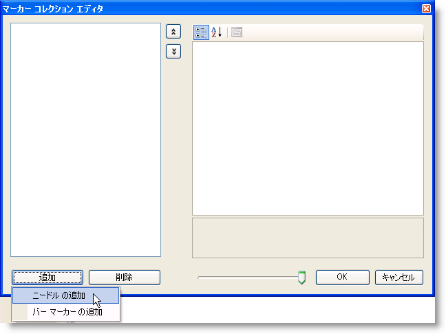

////
|metadata|
{
    "name": "wingauge-creating-a-linear-gauge-in-design-view",
    "controlName": ["WinGauge"],
    "tags": ["Charting","Design Environment"],
    "guid": "{E2D840E5-6222-4B4B-ADEB-9647A28377BD}",
    "buildFlags": [],
    "createdOn": "0001-01-01T00:00:00Z"
}
|metadata|
////

= デザイン ビューでリニア ゲージを作成

増減する情報（例、温度）を視覚的に表すためにはリニア ゲージを使用することができます。

*リニア ゲージをGauge コントロールに追加するには、次の手順に従ってください。*

[start=1]
. デザイン ビューで、フォーム上の UltraGauge コントロールをクリックします。
[start=2]
. [プロパティ] ウィンドウで、pick:[win-forms="link:{ApiPlatform}win.ultrawingauge{ApiVersion}~infragistics.win.ultrawingauge.ultragauge~gauges.html[Gauges]"]  プロパティをクリックします。次に省略記号（...）ボタンをクリックして、ゲージ コレクション エディタを開きます。
[start=3]
. ゲージ コレクション エディタで、[追加] をクリックして、[リニア ゲージを追加] を選択します。

[start=4]
. この時点で、リニア ゲージが追加されましたが、特定のプロパティが設定されていないため表示されません。Gauge の構成を開始するために、Misc プロパティを展開します。
[start=5]
. pick:[win-forms="link:{ApiPlatform}win.ultrawingauge{ApiVersion}~infragistics.ultragauge.resources.dialappearance~brushelement.html[BrushElement]"]  プロパティをクリックして、新しい BrushElement オブジェクトを作成します。次にドロップダウン リストから、[単色塗りつぶし] を選択します。
[start=6]
. BrushElement プロパティを展開して、pick:[win-forms="link:{ApiPlatform}win.ultrawingauge{ApiVersion}~infragistics.ultragauge.resources.colorstop~color.html[Color]"]  プロパティをシルバーに設定します。
[start=7]
. この時点で、リニア ゲージが表示されます。

image::images/Gauge_Adding_Digital_Gauge_02.png[]

[start=8]
. pick:[win-forms="link:{ApiPlatform}win.ultrawingauge{ApiVersion}~infragistics.ultragauge.resources.gauge~bounds.html[Bounds]"]  プロパティを展開することによって、ゲージのサイズを変更します。Width プロパティを 250、Height プロパティを 100 に設定します。
[start=9]
. pick:[win-forms="link:{ApiPlatform}win.ultrawingauge{ApiVersion}~infragistics.ultragauge.resources.lineargauge~scales.html[Scales]"]  プロパティをクリックすることにより、新しいスケールが作成されます。次に省略記号（...）ボタンをクリックして、スケール コレクション エディタを開きます。
[start=10]
. [追加] をクリックして新しいスケールを作成します。
[start=11]
. スケールの pick:[win-forms="link:{ApiPlatform}win.ultrawingauge{ApiVersion}~infragistics.ultragauge.resources.axis.html[Axis]"]  プロパティをクリックして、新しい Axis オブジェクトを作成します。次にドロップダウン リストから、[数値軸] を選択します。
[start=12]
. Axis プロパティを展開して、pick:[win-forms="link:{ApiPlatform}win.ultrawingauge{ApiVersion}~infragistics.ultragauge.resources.gaugerange~startvalue.html[StartValue]"]  プロパティを 0 に設定します。pick:[win-forms="link:{ApiPlatform}win.ultrawingauge{ApiVersion}~infragistics.ultragauge.resources.gaugerange~endvalue.html[EndValue]"]  プロパティを 100 に設定します。
[start=13]
. pick:[win-forms="link:{ApiPlatform}win.ultrawingauge{ApiVersion}~infragistics.ultragauge.resources.lineargaugescale~majortickmarks.html[MajorTickmarks]"]  プロパティを展開することによって、主目盛をスケールに追加します。次に、pick:[win-forms="link:{ApiPlatform}win.ultrawingauge{ApiVersion}~infragistics.ultragauge.resources.gaugerange~brushelement.html[BrushElement]"]  プロパティをクリックして、ドロップダウン リストから、[単色塗りつぶし] を選択することによって、新しいブラシ エレメントを作成します。
[start=14]
. BrushElement プロパティを展開して、pick:[win-forms="link:{ApiPlatform}win.ultrawingauge{ApiVersion}~infragistics.ultragauge.resources.solidfillbrushelement~color.html[Color]"]  プロパティを白に設定します。
[start=15]
. 目盛の外側の端を揃えるためには、pick:[win-forms="link:{ApiPlatform}win.ultrawingauge{ApiVersion}~infragistics.ultragauge.resources.lineargaugescale~endextent.html[EndExtent]"]  プロパティを 55 に設定します。
[start=16]
. 値が EndExtent プロパティよりも小さくなるように pick:[win-forms="link:{ApiPlatform}win.ultrawingauge{ApiVersion}~infragistics.ultragauge.resources.lineargaugescale~startextent.html[StartExtent]"]  プロパティを変更することも必要です。StartExtent プロパティを 45 に設定します。
[start=17]
. pick:[win-forms="link:{ApiPlatform}win.ultrawingauge{ApiVersion}~infragistics.ultragauge.resources.lineargaugescaletickmarkappearance~startwidth.html[StartWidth]"]  プロパティを 2 に pick:[win-forms="link:{ApiPlatform}win.ultrawingauge{ApiVersion}~infragistics.ultragauge.resources.lineargaugescaletickmarkappearance~endwidth.html[EndWidth]"]  プロパティを 2 に設定します。
[start=18]
. pick:[win-forms="link:{ApiPlatform}win.ultrawingauge{ApiVersion}~infragistics.ultragauge.resources.strokeelement.html[StrokeElement]"]  プロパティを展開し、色をグレーに設定することによって、主目盛のストローク エレメントを設定します。
[start=19]
. pick:[win-forms="link:{ApiPlatform}win.ultrawingauge{ApiVersion}~infragistics.ultragauge.resources.lineargaugescale~minortickmarks.html[MinorTickmarks]"]  プロパティを展開することによって、副目盛をスケールに追加します。
[start=20]
. StrokeElement プロパティを展開し、Color プロパティを黒に設定します。
[start=21]
. 目盛の外側の端を揃えるためには、EndExtent プロパティを 50 に設定します。
[start=22]
. 値が EndExtent プロパティよりも小さくなるように StartExtent プロパティを変更することも必要です。StartExtent プロパティを 45 に設定します。
[start=23]
. StartWidth プロパティを 1、EndWidth プロパティを 1、Frequency プロパティを 2 に設定します。
[start=24]
. pick:[win-forms="link:{ApiPlatform}win.ultrawingauge{ApiVersion}~infragistics.ultragauge.resources.labelappearance.html[Label]"]  プロパティを展開することによって、ラベルをスケールに追加します。次に、BrushElement プロパティをクリックして、ドロップダウン リストから、[単色塗りつぶし] を選択することによって、新しいブラシ エレメントを作成します。
[start=25]
. BrushElement プロパティを展開し、Color プロパティを白に設定します。
[start=26]
. Extent プロパティを 65 に、pick:[win-forms="link:{ApiPlatform}win.ultrawingauge{ApiVersion}~infragistics.ultragauge.resources.lineargaugescalelabelsappearance~zposition.html[ZPosition]"]  プロパティを AboveMarkers に設定します。
[start=27]
. これで必要となるのは、表示すべき現在の値を示すマーカーだけです。スケールの pick:[win-forms="link:{ApiPlatform}win.ultrawingauge{ApiVersion}~infragistics.ultragauge.resources.lineargaugescale~markers.html[Markers]"]  プロパティをクリックして、省略記号（…）ボタンをクリックして、マーカー コレクション エディタを開きます。

[start=28]
. [追加] をクリックして、[針の追加] を選択します。
[start=29]
. これで針が追加されますが、ブラシ エレメントが作成されていないので表示されません。
[start=30]
. BrushElement プロパティをクリックして、新しい BrushElement オブジェクトを作成します。次にドロップダウン リストから、[単色塗りつぶし] を選択します。
[start=31]
. BrushElement プロパティを展開し、Color プロパティをグレーに設定します。
[start=32]
. 針の値を指定していないので、針は依然として表示されません。Value プロパティを 20 に設定します。
[start=33]
. StartExtent プロパティを 10、EndExtent プロパティを 45、MidExtent プロパティを 30 に設定します。
[start=34]
. プロジェクトを実行します。以下のフォームのように表示されるはずです。

image::images/Gauge_Adding_Linear_Gauge_04.png[]