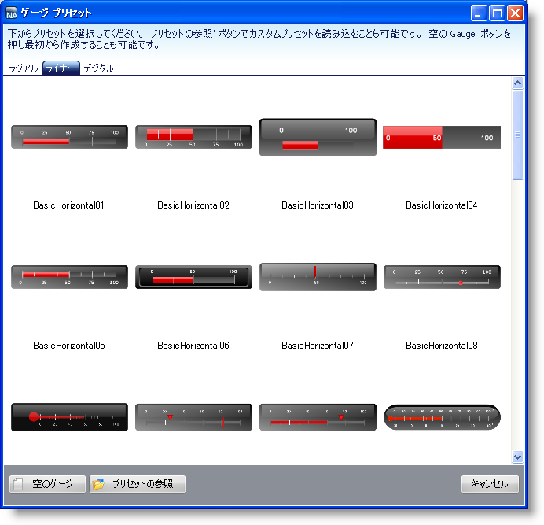
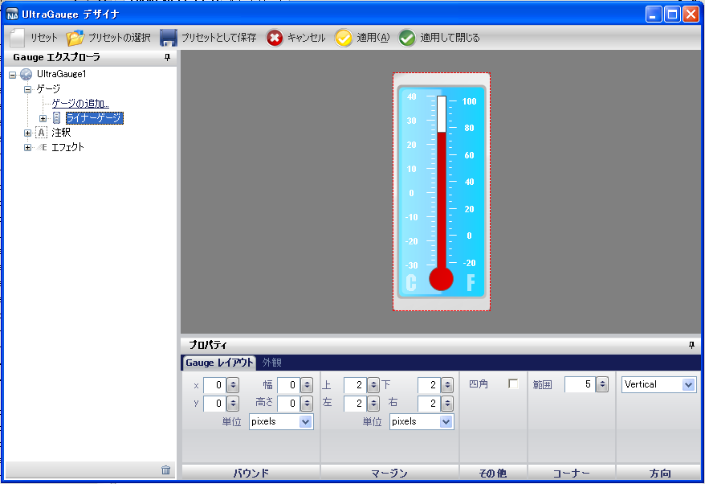

////

|metadata|
{
    "name": "wingauge-creating-a-linear-gauge-using-the-gauge-presets",
    "controlName": ["WinGauge"],
    "tags": ["Charting"],
    "guid": "{0FD9DEA6-E781-4B3D-87E1-E0B6F265E2C5}",  
    "buildFlags": [],
    "createdOn": "0001-01-01T00:00:00Z"
}
|metadata|
////

= ゲージ プリセットを使用してリニア ゲージを作成

== 始める前に

ゲージ デザイナでリニア ゲージを作成すると、事前に定義したプリセットを使用できるので、リニア ゲージの作成プロセスが簡単になります。

== 達成すること

リニア ゲージを作成するためにゲージ デザイナを使用することは、温度計のような視覚的に魅力的でプロフェッショナルが作成した見栄えのゲージを作成する際に役に立ちます。

== 次の手順を実行します

[start=1]
. ツールボックスから、UltraGauge コントロールをフォームにドラッグします。ゲージ デザイナが開きます。

image::images/Gauge_Creating_a_Linear_Gauge_Using_the_Gauge_Designer_01.png[]

[start=2]
. ツールバーで、[プリセットを開く] をクリックします。
[start=3]
. [線形] タブをクリックします。

[start=4]
. 事前に定義されたリニア ゲージを選択します。ゲージを選択すると、インタラクティブなプレビュー領域にそのゲージが表示します。

[start=5]
. ゲージ デザイナを閉じることなく選択したプリセットを使用してリニア ゲージを作成するには、[適用] をクリックします。選択したプリセットを使用してリニア ゲージを作成しデザイナを自動的に閉じるには、[適用して閉じる] をクリックします。
[start=6]
. アプリケーションを実行します。以下のフォームのように表示されるはずです。

image::images/Gauge_Creating_a_Linear_Gauge_Using_the_Gauge_Designer_04.png[]