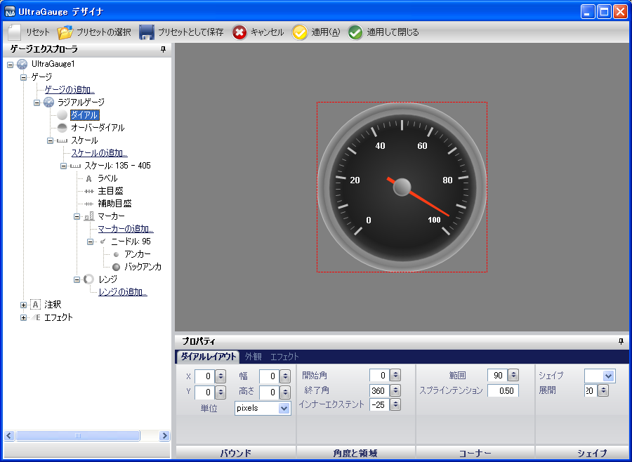
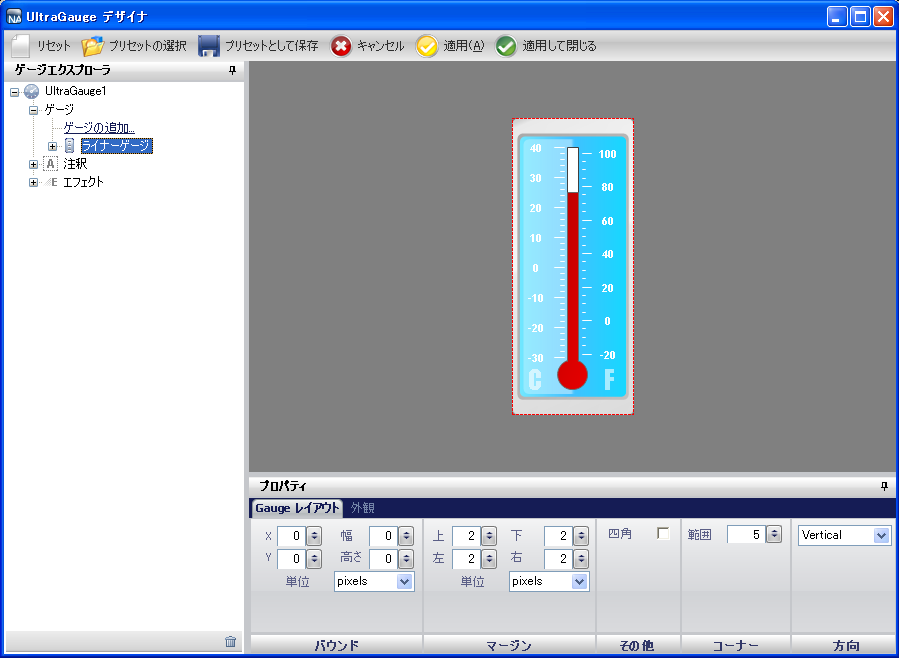
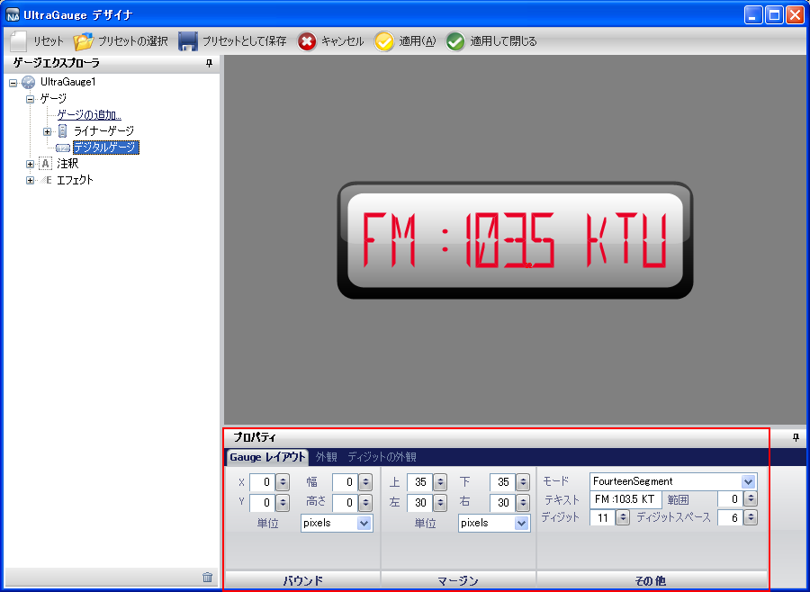
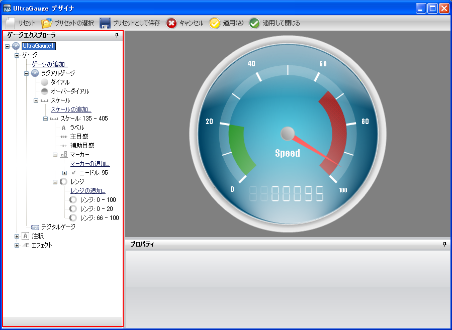

////

|metadata|
{
    "name": "wingauge-designer-added-to-wingauge-whats-new-20072",
    "controlName": [],
    "tags": [],
    "guid": "{FDE5F9A1-50CB-4A86-A385-A8FB0015956C}",  
    "buildFlags": [],
    "createdOn": "0001-01-01T00:00:00Z"
}
|metadata|
////

= WinGauge に追加されたデザイナ

2007 Volume 2 リリースから開始しますが、デザイナを WinGauge™ で使用できるようになります。

デザイナは、基本から複雑なデザインまでのリニア ゲージ、デジタル ゲージ、およびラジアル ゲージのギャラリーで構成されます。デザイナによって事前に定義されたゲージを選択し、Gauge コントロールに追加することができます。また、デザイナのユーザー フレンドリなインタフェースからゲージのプロパティを簡単に操作できます。

== ゲージ プリセット

デザイナは、プロフェッショナルの見栄えのゲージを最小作業で作成する手助けをします。たとえば、温度計のような垂直方向のリニア ゲージを作成するには、デザイナからプリセットを選択し、Gauge コントロールに追加するだけです。

以下のスクリーンショットは、デザイナのギャラリーから事前に定義したゲージの例を示します。

== カスタマイズ

デザイナ プリセットのカスタマイズは、デザイナでの非常に簡単なプロセスです。デザイナのプロパティ パネルでは、プロパティのすべての値が表示されます。プロパティ パネルでこれらの値を編集する場合、変更はインタラクティブなプレビュー領域に即座に反映されます。

以下のスクリーンショットは [プロパティ] ウィンドウに表示されるデジタル ゲージのプロパティの例を示しています。

== ナビゲーション

デザイナのゲージ エクスプローラを使用してゲージ コントロールのプロパティからナビゲートするのは簡単です。WinGauge コントロールを展開してコントロール内の個々のゲージを表示できます。各ゲージを選択すると、インタラクティブなプレビュー領域で強調表示されます。プロパティを表示するために各ゲージを展開したり、インタラクティブなプレビュー領域でプロパティを強調表示することができます。

以下のスクリーンショットは、ラジアル ゲージが選択された状態のデザイナのゲージ エクスプローラを示しています。

== 関連トピック

link:wingauge-designer.html[ゲージ デザイナ]