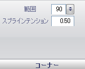

////

|metadata|
{
    "name": "wingauge-dial-corners-pane",
    "controlName": ["WinGauge"],
    "tags": ["Charting"],
    "guid": "{2F4071EC-23E4-4BB6-8AF8-5AB7CD562602}",  
    "buildFlags": [],
    "createdOn": "0001-01-01T00:00:00Z"
}
|metadata|
////

= 角ペイン

[角] ペインは、ラジアル ゲージ上の目盛盤の角のサイズを決定します。

pick:[win-forms="link:{ApiPlatform}win.ultrawingauge{ApiVersion}~infragistics.ultragauge.resources.dialappearance~cornerextent.html[範囲]"]  -- この値を 0 から 999 の整数に設定します。描く角度が360度未満、または link:wingauge-shape-pane.html[[形状] ペイン]の矩形に文字盤の形状を変更するために、 link:wingauge-angle-and-extents-pane.html[[角度と範囲] ペイン] で開始角度と終了角度を設定すると、範囲の値の効果を確認できます。　 表示される角の丸みを決定します。

pick:[win-forms="link:{ApiPlatform}win.ultrawingauge{ApiVersion}~infragistics.ultragauge.resources.dialappearance~cornersplinetension.html[スプライン テンション]"]  -- この値を 0.0 から 1.0 に設定します。この値は、目盛盤の角の曲線の程度を決定します。

== 関連トピック

link:wingauge-dial-layout-tab.html[目盛盤レイアウト タブ]