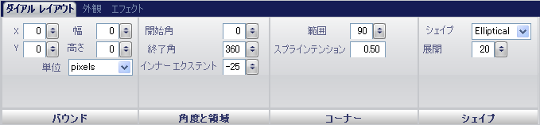

////

|metadata|
{
    "name": "wingauge-dial-layout-tab",
    "controlName": ["WinGauge"],
    "tags": ["Charting"],
    "guid": "{686CE8F4-13BD-440E-B64B-87F9483DFBBE}",  
    "buildFlags": [],
    "createdOn": "0001-01-01T00:00:00Z"
}
|metadata|
////

= 目盛盤レイアウト タブ

pick:[win-forms="link:{ApiPlatform}win.ultrawingauge{ApiVersion}~infragistics.ultragauge.resources.radialgauge~dial.html[Dial]"]  プロパティはラジアル ゲージの形状を決定します。デフォルトで、目盛盤は 360 度を描くため、円として表示されます。

[プロパティ] パネルの [目盛盤レイアウト] タブを使用して、ゲージ上の目盛盤をカスタマイズできます。ゲージ エクスプローラで [目盛盤] をクリックする（[ラジアル ゲージ] > [目盛盤]）をクリックする、またはインタラクティブなプレビュー領域でラジアル ゲージの目盛盤をクリックするのいずれかで、このタブにアクセスすることができます。

タブは以下の 4 つのペインに分割されています。

* link:wingauge-bounds-pane.html[境界]
* link:wingauge-angle-and-extents-pane.html[角度と範囲]
* link:wingauge-corners-pane.html[角]
* link:wingauge-shape-pane.html[形状]

以下のスクリーンショットは、上記のスクリーンショットで指定されたレイアウト設定に基づいて作成された目盛盤を示しています。

image::images/Dial_Layout_Tab_02.png[]