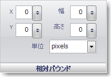

////

|metadata|
{
    "name": "wingauge-digit-appearance-relative-bounds",
    "controlName": ["WinGauge"],
    "tags": ["Charting"],
    "guid": "{8A5303C2-69F2-4056-B54B-9081D7F9A3F8}",  
    "buildFlags": [],
    "createdOn": "2010-06-04T11:50:14Z"
}
|metadata|
////

= 数字外観の相対バウンド

[相対バウンド] ペインは、ゲージ上の数字ブラシ要素のサイズと位置を決定します。

X -- この値は Gauge コントロールの左側からの数字ブラシ要素の距離を決定します。

Y -- この値は Gauge コントロールの上側からの数字ブラシ要素の距離を決定します。

Width -- この値は数字ブラシ要素の幅を決定します。

Height -- この値は数字ブラシ要素の高さを決定します。

Units -- この値は数字ブラシ要素の測定の単位を指定します。数字ブラシ要素は、ピクセルまたは Gauge コントロールのパーセントで測定できます。

== 関連トピック

link:wingauge-appearance-tab.html[外観タブ]

link:wingauge-digit-appearance-tab.html[数字外観タブ]

link:wingauge-labels-appearance-tab.html[ラベル外観タブ]

link:wingauge-effects-tab.html[効果タブ]