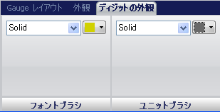

////

|metadata|
{
    "name": "wingauge-digit-appearance-tab",
    "controlName": ["WinGauge"],
    "tags": ["Charting"],
    "guid": "{2E135F4A-0654-47A2-847A-E6AD555D8170}",  
    "buildFlags": [],
    "createdOn": "0001-01-01T00:00:00Z"
}
|metadata|
////

= 数字外観タブ

[数字外観] タブは、デジタル ゲージ上のデータをカスタマイズするために使用されます。ゲージ エクスプローラで [デジタル ゲージ] をクリックする、またはインタラクティブなプレビュー領域でデジタル ゲージをクリックするのいずれかによって、このタブにアクセスできます。

タブは以下の 2 つのペインに分割されています。

* link:wingauge-font-brush-pane.html[フォント ブラシ]
* link:wingauge-unlit-brush-pane.html[アンリット ブラシ]

以下のスクリーンショットは、上記のスクリーンショットで指定された数字外観設定に基づいて作成されたデジタル ゲージを示しています。

image::images/Digit_Appearance_Tab_02.png[]