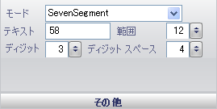

////

|metadata|
{
    "name": "wingauge-digital-misc-pane",
    "controlName": ["WinGauge"],
    "tags": ["Charting"],
    "guid": "{06111C97-CDE0-4A1A-87CD-7528B4F84AFC}",  
    "buildFlags": [],
    "createdOn": "0001-01-01T00:00:00Z"
}
|metadata|
////

= その他ペイン

[その他] ペインは、デジタル ゲージのさまざまなプロパティを設定するために使用されます。

pick:[win-forms="link:{ApiPlatform}win.ultrawingauge{ApiVersion}~infragistics.ultragauge.resources.segmenteddigitalgauge~mode.html[モード]"]  -- モードの値は、デジタル ゲージが 7 セグメント表示で提示されるのか、14 セグメント表示で提示されるのかを指定します。[モード] プロパティの詳細は、 link:wingauge-working-with-digital-gauges.html[「デジタル ゲージでの作業」]を参照してください。

pick:[win-forms="link:{ApiPlatform}win.ultrawingauge{ApiVersion}~infragistics.ultragauge.resources.digitalgauge~text.html[テキスト]"]  -- このテキスト値は、デジタル ゲージに表示されるデータを表します。

pick:[win-forms="link:{ApiPlatform}win.ultrawingauge{ApiVersion}~infragistics.ultragauge.resources.gauge~cornerextent.html[範囲]"]  -- この値を 0 から 100 の整数に設定します。この値は、デジタル ゲージの角の丸みを設定します。

pick:[win-forms="link:{ApiPlatform}win.ultrawingauge{ApiVersion}~infragistics.ultragauge.resources.digitalgauge~digits.html[桁]"]  -- 桁値はゲージが表示できる桁数を決定します。

pick:[win-forms="link:{ApiPlatform}win.ultrawingauge{ApiVersion}~infragistics.ultragauge.resources.digitalgauge~digitspacing.html[数字のスペース]"]  -- この値はゲージに表示される各数字間の距離を設定します。

== 関連トピック

link:wingauge-digital-gauge.html[デジタル ゲージ]