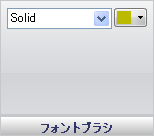

////

|metadata|
{
    "name": "wingauge-font-brush-pane",
    "controlName": ["WinGauge"],
    "tags": ["Charting"],
    "guid": "{AC542179-D79B-4649-BF88-276672EEF3BE}",  
    "buildFlags": [],
    "createdOn": "0001-01-01T00:00:00Z"
}
|metadata|
////

= フォント ブラシ ペイン

[フォント ブラシ] ペインは、デジタル ゲージ上の数字をカスタマイズするために使用されます。

pick:[win-forms="link:{ApiPlatform}win.ultrawingauge{ApiVersion}~infragistics.ultragauge.resources.digitalgauge~fontbrushelement.html[ブラシ タイプ]"]  -- このドロップダウン リストによって、デジタル ゲージ上の数字のブラシ タイプを変更できます。

pick:[win-forms="link:{ApiPlatform}win.ultrawingauge{ApiVersion}~infragistics.ultragauge.resources.digitalgauge~fontbrushelement.html[ブラシの色]"]  -- 選択するブラシのタイプによって、ブラシの色のリストにそのブラシ タイプで使用可能な色が格納されます。

== 関連トピック

link:wingauge-digit-appearance-tab.html[数字外観タブ]