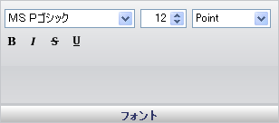

////

|metadata|
{
    "name": "wingauge-font-pane",
    "controlName": ["WinGauge"],
    "tags": ["Charting"],
    "guid": "{697F677F-7B2C-48B3-80D6-95636AB1E82E}",  
    "buildFlags": [],
    "createdOn": "0001-01-01T00:00:00Z"
}
|metadata|
////

= フォント ペイン

[フォント] ペインは、ゲージ上のレベルのフォント設定を編集するために使用されます。

pick:[win-forms="link:{ApiPlatform}win.ultrawingauge{ApiVersion}~infragistics.ultragauge.resources.labelappearance~font.html[フォント]"]  -- この値は、ラベルのフォント（例、Trebuchet MS）を指定します。

サイズ -- この値を 0 から 100 の整数に設定します。この値は、ラベルのフォントのサイズを設定します。

タイプ --この値は、フォント サイズの測定のタイプを指定します。

スタイル -- この値は、フォントのフォーマッティングを指定します（例、太字および斜体）。

== 関連トピック

link:wingauge-labels-appearance-tab.html[ラベル外観タブ]