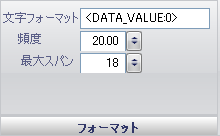

////

|metadata|
{
    "name": "wingauge-formatting-pane",
    "controlName": ["WinGauge"],
    "tags": ["Charting"],
    "guid": "{B799F362-7CF1-4FF6-9456-6C9AFACF331A}",  
    "buildFlags": [],
    "createdOn": "0001-01-01T00:00:00Z"
}
|metadata|
////

= フォーマッティング ペイン

[フォーマッティング] ペインは、ラベルのパターンと値を決定します。

pick:[win-forms="link:{ApiPlatform}win.ultrawingauge{ApiVersion}~infragistics.ultragauge.resources.labelappearance~formatstring.html[フォーマット文字列]"]  -- この値はラベルの値を設定します。ラベルを数値にしたい場合には、値を <DATA_VALUE:0> に設定する必要があります。そうでない場合にはラベルのテキストを入力することができます。

pick:[win-forms="link:{ApiPlatform}win.ultrawingauge{ApiVersion}~infragistics.ultragauge.resources.gaugescalelabelsappearance~frequency.html[頻度]"]  -- 項目の値を 1.00 から 100.00 の値に設定します。この値は、ラベルが表示される間隔を決定します。

pick:[win-forms="link:{ApiPlatform}win.ultrawingauge{ApiVersion}~infragistics.ultragauge.resources.radialgaugescalelabelsappearance~spanmaximum.html[スパン最大]"]  -- この値を 0 から 100 の整数に設定します。この値は、ゲージ上のラベルのサイズを設定します。

== 関連トピック

link:wingauge-labels-layout-tab.html[ラベル レイアウト タブ]