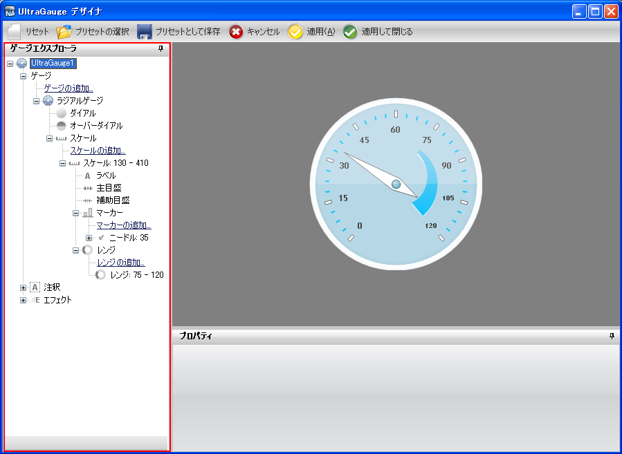
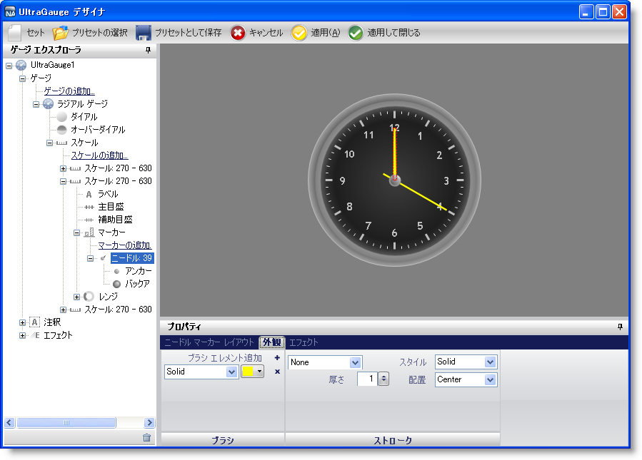

////

|metadata|
{
    "name": "wingauge-gauge-explorer",
    "controlName": ["WinGauge"],
    "tags": ["Charting","Design Environment"],
    "guid": "{BAF8AB19-A3E6-4993-87F6-4ECA857BE316}",  
    "buildFlags": [],
    "createdOn": "0001-01-01T00:00:00Z"
}
|metadata|
////

= ゲージ エクスプローラ

デザイナのゲージ エクスプローラによって、既存の Gauge コントロールに線形、デジタル、放射型の各ゲージを追加/削除することができます。また Gauge コントロールのプロパティによって簡単にナビゲートすることも可能です。

Gauge コントロールは多数の異なるゲージによって構成することができ、これらすべてはゲージ エクスプローラから確認および管理できます。ゲージ エクスプローラからゲージを選択すると、そのゲージがインタラクティブなプレビュー領域に強調表示され、[プロパティ] パネルには選択されたゲージのプロパティが表示されます。

以下のスクリーンショットは、ラジアル ゲージが選択された状態のデザイナのゲージ エクスプローラを示しています。

ゲージ エクスプローラは、ゲージの個々のプロパティにドリル ダウンすることも可能です。ゲージ エクスプローラからゲージ プロパティを選択すると、インタラクティブなプレビュー領域にプロパティがゲージ上で強調表示された状態で表示されます。たとえば、時計を表すラジアル ゲージの場合、ゲージ エクスプローラからゲージの pick:[win-forms="link:{ApiPlatform}win.ultrawingauge{ApiVersion}~infragistics.ultragauge.resources.radialgaugeneedle.html[針]"]  プロパティをクリックすると、以下のスクリーンショットで示すように、インタラクティブなプレビュー領域に時計の針が強調表示されます。

