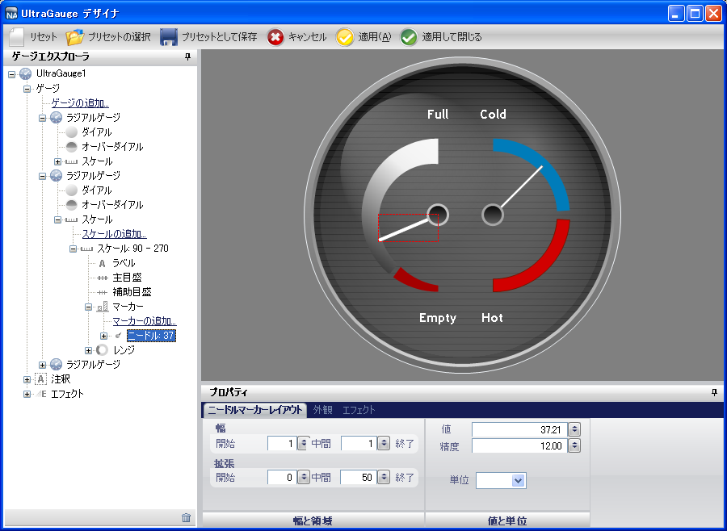

////

|metadata|
{
    "name": "wingauge-interactive-preview-area",
    "controlName": ["WinGauge"],
    "tags": [],
    "guid": "{B30527D6-6287-4787-AA46-CF429AD16D60}",  
    "buildFlags": [],
    "createdOn": "0001-01-01T00:00:00Z"
}
|metadata|
////

= インタラクティブなプレビュー領域

インタラクティブなプレビュー領域は、ゲージ エクスプローラで現在選択されているオブジェクトを表示します。選択されたオブジェクトは赤で強調表示されます。[プロパティ] パネルから選択したオブジェクトのプロパティを修正する場合、その変更がインタラクティブなプレビュー領域にすぐに反映されます。

プレビュー領域からオブジェクトを選択することも可能です。そのプロパティが [プロパティ] パネルに表示されますが、ゲージ エクスプローラでも強調表示されます。

以下のスクリーンショットは、インタラクティブなプレビュー領域に表示されるラジアル ゲージを示しています。マーカー プロパティの輪郭が赤のボックスで表示されており、[プロパティ] パネルには [マーカー] プロパティの設定が表示されています。

