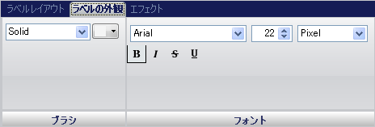

////

|metadata|
{
    "name": "wingauge-labels-appearance-tab",
    "controlName": ["WinGauge"],
    "tags": ["Charting"],
    "guid": "{0B8026CE-2826-4EB8-B434-402212E6DCBF}",  
    "buildFlags": [],
    "createdOn": "0001-01-01T00:00:00Z"
}
|metadata|
////

= ラベル外観タブ

[ラベル外観] タブは、ゲージ上のラベルをカスタマイズするために使用されます。ゲージ エクスプローラで [ラベル] をクリックする（[放射型/リニア ゲージ] > [スケール] > [ラベル]）、またはインタラクティブなプレビュー領域からゲージ上のラベルを選択することによって、このタブにアクセスできます。

このタブは以下の 2 つのペインに分割されています。

* link:wingauge-brush-pane.html[ブラシ]
* link:wingauge-font-pane.html[フォント]

以下のスクリーンショットは、上記のスクリーンショットで指定されたラベル外観設定に基づいて作成されたラベルを示しています。

image::images/Labels_Appearance_Tab_02.png[]