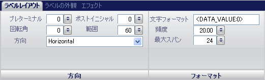

////

|metadata|
{
    "name": "wingauge-labels-layout-tab",
    "controlName": ["WinGauge"],
    "tags": ["Charting"],
    "guid": "{555C5B17-360C-4E9C-9763-3F74E4FD4546}",  
    "buildFlags": [],
    "createdOn": "0001-01-01T00:00:00Z"
}
|metadata|
////

= ラベル レイアウト タブ

Gauge コントロールの pick:[win-forms="link:{ApiPlatform}win.ultrawingauge{ApiVersion}~infragistics.ultragauge.resources.radialgaugescale~labels.html[Labels]"]  プロパティはスケール上の値を表します。ラベルはスケールの値に関連付けられた数値またはテキスト値です。

[プロパティ] パネルの [ラベル レイアウト] タブを使用して、ゲージ上のラベルをカスタマイズできます。このタブにアクセスするには、ゲージ エクスプローラで [ラベル] をクリックします（[ゲージ] > [スケール] > [ラベル]）。

タブは以下の 2 つのペインに分割されています。

* link:wingauge-orientation-pane.html[方向]
* link:wingauge-formatting-pane.html[フォーマッティング]

以下のスクリーンショットは、上記のスクリーンショットで指定されたレイアウト設定に基づいて作成されたラベルを示しています。

image::images/Labels_Layout_Tab_02.png[]