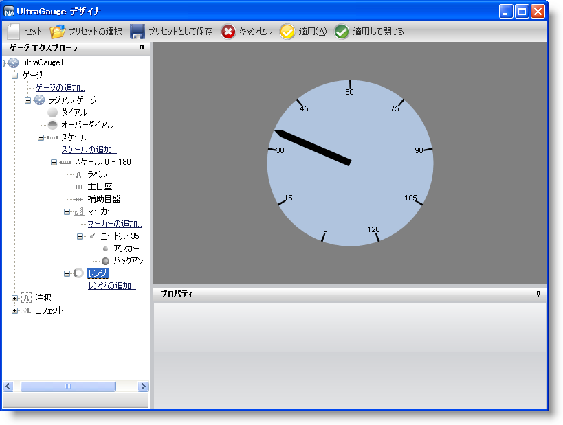

////

|metadata|
{
    "name": "wingauge-layout-of-the-gauge-designer",
    "controlName": ["WinGauge"],
    "tags": [],
    "guid": "{B34901B5-A03D-4A43-940A-F56B629E2701}",  
    "buildFlags": [],
    "createdOn": "0001-01-01T00:00:00Z"
}
|metadata|
////

= ゲージ デザイナのレイアウト

ゲージ デザイナは、基本的に以下の 3 つの主要なセクションで構成されています。

* link:wingauge-gauge-explorer.html[ゲージ エクスプローラ] -- このセクションはデザイナの左側に配置されており、Gauge コントロールの簡単なナビゲートを可能にします。
* link:wingauge-properties-panel.html[[プロパティ] パネル] -- このセクションはデザイナの右下のペインに配置され、ゲージのプロパティを編集することができます。
* link:wingauge-interactive-preview-area.html[インタラクティブなプレビュー領域] -- このセクションはデザイナの右上のペインに配置され、ゲージを表示したり、ゲージに行った変更を動的に表示することができます。

以下のスクリーンショットはデザイナのレイアウトを表示しています。

