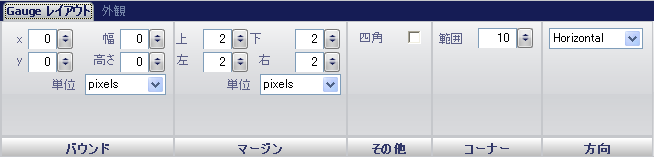

////

|metadata|
{
    "name": "wingauge-linear-gauge",
    "controlName": ["WinGauge"],
    "tags": ["Charting"],
    "guid": "{F97D32E0-079E-49B3-85DF-1C6EABDF1BA2}",  
    "buildFlags": [],
    "createdOn": "0001-01-01T00:00:00Z"
}
|metadata|
////

= リニア ゲージ

リニア ゲージは、増減するデータ（たとえば、温度）を視覚的に表示するために使用されます。温度計を表すために垂直方向のリニア ゲージを作成することができます。

[プロパティ] パネルの [ゲージ レイアウト] タブを使用することにより、リニア ゲージの表示を編集できます。ゲージ エクスプローラで [リニア ゲージ] をクリックする、またはインタラクティブなプレビュー領域でリニア ゲージをクリックするのいずれかによって、このタブを表示できます。

タブは以下の 4 つのペインに分割されています。

* link:wingauge-bounds-pane.html[境界]
* link:wingauge-margin-pane.html[マージン]
* link:wingauge-corners-pane.html[角]
* link:wingauge-orientation-pane.html[方向]
* link:wingauge-linear-misc-pane.html[その他]

以下のスクリーンショットは、上記のスクリーンショットで指定されたレイアウト設定に基づいて作成されたリニア ゲージを示しています。

image::images/Linear_Gauge_Layout_Tab_02.png[]