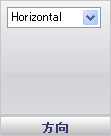

////

|metadata|
{
    "name": "wingauge-linear-orientation-pane",
    "controlName": ["WinGauge"],
    "tags": ["Charting"],
    "guid": "{BE21FBA6-B658-4916-8960-49C23295604C}",  
    "buildFlags": [],
    "createdOn": "0001-01-01T00:00:00Z"
}
|metadata|
////

= 方向ペイン

[方向] ペインは、Gauge コントロールでリニア ゲージの位置を設定するために使用されます。

方向 -- この値はゲージの位置を指定します。方向は [水平] または [垂直] に設定できます。

== 関連トピック

link:wingauge-linear-gauge.html[リニア ゲージ]