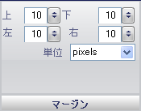

////

|metadata|
{
    "name": "wingauge-margin-pane",
    "controlName": ["WinGauge"],
    "tags": ["Charting"],
    "guid": "{341F41E0-52AD-4C40-83BE-D06C90FC819F}",  
    "buildFlags": [],
    "createdOn": "0001-01-01T00:00:00Z"
}
|metadata|
////

= マージン ペイン

[マージン] ペインは、Gauge コントロールでゲージの位置を設定するために使用されます。

pick:[win-forms="link:{ApiPlatform}win.ultrawingauge{ApiVersion}~infragistics.ultragauge.resources.gauge~margin.html[上]"]  -- [上] の値を Gauge コントロールの高さを超えるまたは 0 未満となるように設定すると、ゲージが Gauge コントロールに表示されない場合があります。[上] の値は、Gauge コントロールの上部のマージンのサイズを表します。

pick:[win-forms="link:{ApiPlatform}win.ultrawingauge{ApiVersion}~infragistics.ultragauge.resources.gauge~margin.html[下]"]  -- [下] の値を Gauge コントロールの高さを超えるまたは 0 未満となるように設定すると、ゲージが Gauge コントロールに表示されない場合があります。[下] の値は、Gauge コントロールの下部のマージンのサイズを表します。

pick:[win-forms="link:{ApiPlatform}win.ultrawingauge{ApiVersion}~infragistics.ultragauge.resources.gauge~margin.html[左]"]  -- [左] の値を Gauge コントロールの幅を超えるまたは 0 未満となるように設定すると、ゲージが Gauge コントロールに表示されない場合があります。[左] の値は、Gauge コントロールの左側のマージンのサイズを表します。

pick:[win-forms="link:{ApiPlatform}win.ultrawingauge{ApiVersion}~infragistics.ultragauge.resources.gauge~margin.html[右]"]  -- [右] の値を Gauge コントロールの幅を超えるまたは 0 未満となるように設定すると、ゲージが Gauge コントロールに表示されない場合があります。[右] の値は、Gauge コントロールの右側のマージンのサイズを表します。

pick:[win-forms="link:{ApiPlatform}win.ultrawingauge{ApiVersion}~infragistics.ultragauge.resources.gauge~margin.html[単位]"]  -- この値は、ゲージの測定の単位を指定します。ゲージは、ピクセルまたは Gauge コントロールのパーセントで測定できます。

== 関連トピック

link:wingauge-digital-gauge.html[デジタル ゲージ]

link:wingauge-linear-gauge.html[リニア ゲージ]

link:wingauge-radial-gauge.html[ラジアル ゲージ]