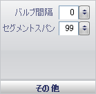
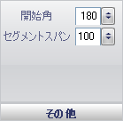

////

|metadata|
{
    "name": "wingauge-misc-pane",
    "controlName": ["WinGauge"],
    "tags": [],
    "guid": "{8E4C0C8F-0A33-44B0-8230-A21BBB1BC54E}",  
    "buildFlags": [],
    "createdOn": "0001-01-01T00:00:00Z"
}
|metadata|
////

= その他ペイン

[その他] ペインは、リニア ゲージにあるバーの先頭にあるバルブのサイズを決定します。リニア ゲージのバルブの例は、温度計のバルブ部分です。ラジアル ゲージでは、[その他] ペインはバー マーカーの開始角度を決定します。

pick:[win-forms="link:{ApiPlatform}win.ultrawingauge{ApiVersion}~infragistics.ultragauge.resources.lineargaugebarmarker~bulbspan.html[バルブ スパン]"]  -- バルブ スパンの値は数値スライダを使用して、0 から 100 に設定できます。ただし、値をテキスト ボックスに入力することも可能です。この値はバルブのサイズです。

pick:[win-forms="link:{ApiPlatform}win.ultrawingauge{ApiVersion}~infragistics.ultragauge.resources.radialgaugebarmarker~startangle.html[開始角度]"]  -- この値を 0 から 360 の整数に設定します。この値はラジアル ゲージのバー マーカーの開始角度を指定します。

pick:[win-forms="link:{ApiPlatform}win.ultrawingauge{ApiVersion}~infragistics.ultragauge.resources.lineargaugebarmarker~segmentspan.html[セグメント スパン]"]  -- セグメント スパンの値は数値スライダを使用して、0 から 100 に設定できます。ただし、値をテキスト ボックスに入力することも可能です。この値は、各セグメントが占めるバー マーカー全体のパーセントです。

== 関連トピック

link:wingauge-bar-marker-layout-tab.html[バー マーカー レイアウト タブ]