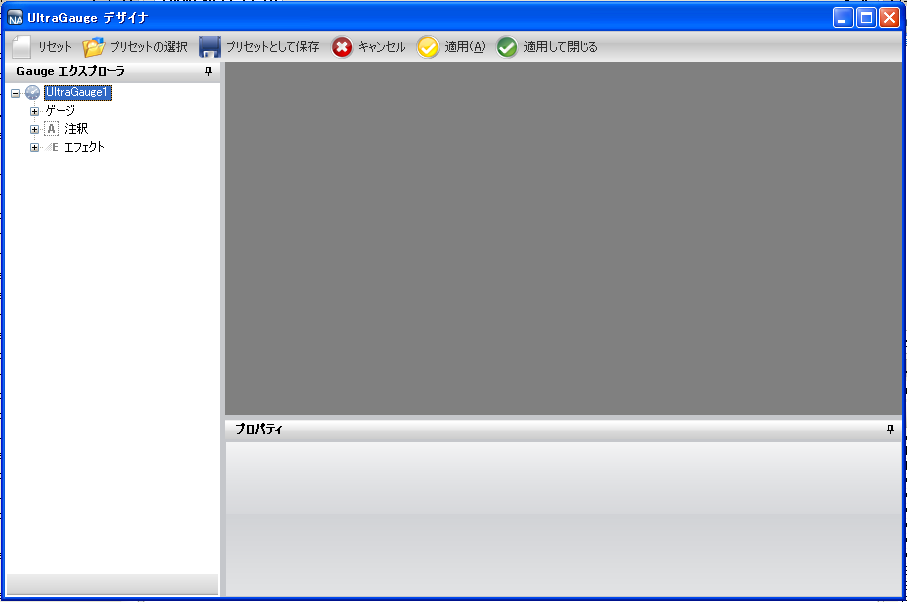
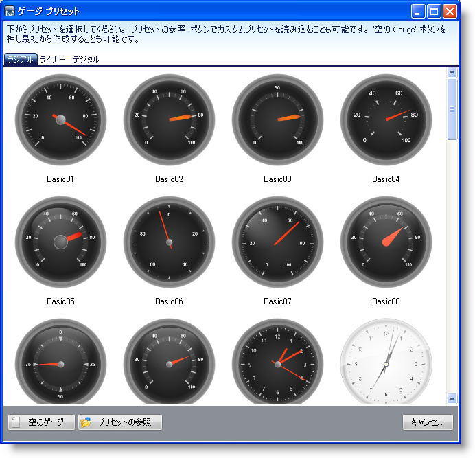
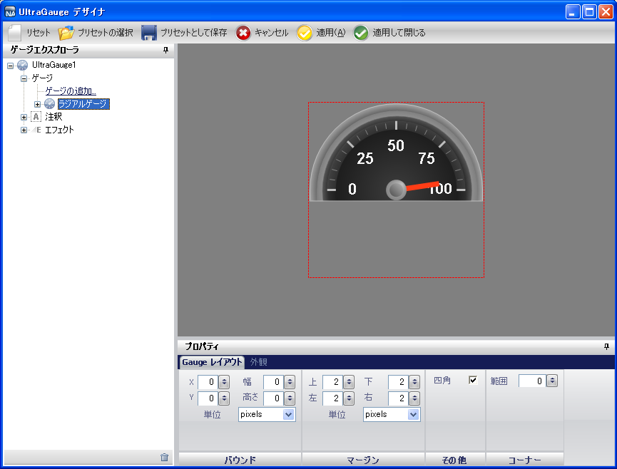
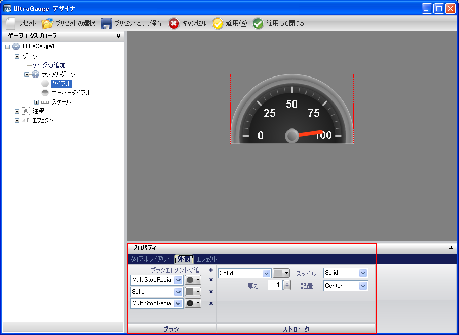
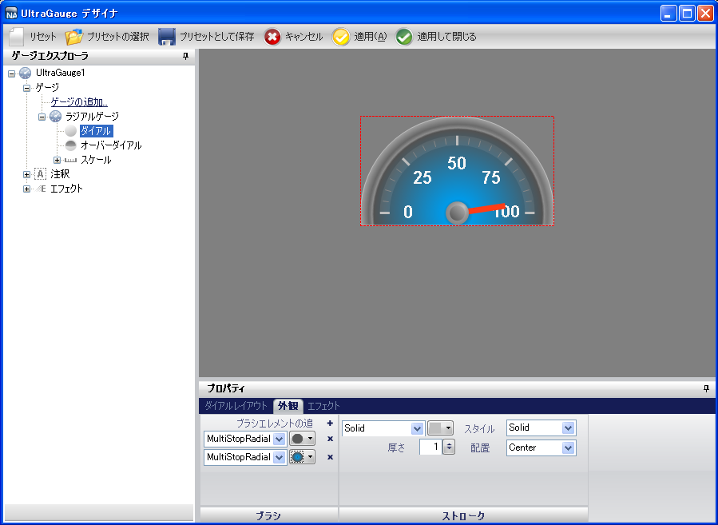

////

|metadata|
{
    "name": "wingauge-modifying-and-saving-a-preset",
    "controlName": ["WinGauge"],
    "tags": [],
    "guid": "{7CFF9E6D-9A39-4322-8BAE-25195C24D928}",  
    "buildFlags": [],
    "createdOn": "0001-01-01T00:00:00Z"
}
|metadata|
////

= プリセットの修正と保存

ゲージ デザイナを使用してゲージ プリセットを修正および保存することができます。これによって、ユーザー固有のニーズに合わせてプリセットをカスタマイズすることができます。たとえば、ユーザー固有のアプリケーションと調和するようにプリセットの色を変更することができます。

*プリセットを修正および保存するには、次の手順に従ってください。*

[start=1]
. ツールボックスから、UltraGauge コントロールをフォームにドラッグします。ゲージ デザイナが開きます。

[start=2]
. ツールバーで、[プリセットの選択] をクリックします。[ゲージ プリセット] ダイアログ ボックスがデフォルトで [放射型] タブが選択された状態で開きます。

[start=3]
. 事前に定義されたラジアル ゲージを選択します。[プリセットのロード] メッセージが表示したら、[OK] をクリックします。ゲージがインタラクティブなプレビュー領域が表示されます。

[start=4]
. ゲージ エクスプローラで、[ゲージ] を展開し、次に [ラジアル ゲージ] を選択して [目盛盤] を選択します。
[start=5]
. [プロパティ] パネルで、 link:wingauge-appearance-tab.html[[外観] タブ]をクリックします。

[start=6]
. link:wingauge-brush-pane.html[[ブラシ] ペイン]で、右手のドロップダウン リストを選択することによって、既存のブラシ エレメントの色を編集します。ブラシ エレメントの詳細については、 link:wingauge-apply-brush-elements-using-the-gauge-designer.html[「ゲージ デザイナを使用してブラシ エレメントを適用」]を参照してください。
[start=7]
. 最初のブラシ エレメントの色を、1 ストップで、 240, 240, 240 から 89, 89, 89 に混ざるように設定します。

** 0.4 のストップ - 色を 210,210,210 に設定。

[start=8]
. クロス（x）アイコンをクリックすることで、2 番目のブラシ エレメントを削除します。
[start=9]
. 3 番目のブラシ エレメントの色を、3 つのストップで、透明から 0, 174, 209 に混ざるように設定します。

** 0.0354 のストップ - 色を 180, 180, 180 に設定。
** 0.041 のストップ - 色を 240, 240, 240 に設定。
** 0.058 のストップ - 色を 0, 79, 118 に設定。

[start=10]
. link:wingauge-stroke-pane.html[[ストローク] ペイン]で、左上のドロップダウン リストから [なし] を選択します。

[start=11]
. ツールバーで、[プリセットとして保存] をクリックします。
[start=12]
. [プリセットとして保存] ダイアログ ボックスで、プリセットの名前と位置を指定し、[保存] をクリックします。これで別の Gauge コントロールに適用するために後で使用できるように、プリセットが保存されます。

== 関連トピック

link:wingauge-creating-a-gauge-using-a-preset.html[プリセットを使用してゲージを作成]

link:wingauge-applying-a-preset.html[プリセットを適用]