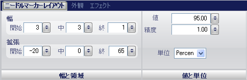

////

|metadata|
{
    "name": "wingauge-needle-marker-layout-tab",
    "controlName": ["WinGauge"],
    "tags": [],
    "guid": "{C1589189-C197-498D-9ED4-91561BCDBA54}",  
    "buildFlags": [],
    "createdOn": "0001-01-01T00:00:00Z"
}
|metadata|
////

= 針マーカー レイアウト タブ

Gauge コントロールの pick:[win-forms="link:{ApiPlatform}win.ultrawingauge{ApiVersion}~infragistics.ultragauge.resources.radialgaugeneedle.html[Needle Marker]"]  プロパティは、スケール上の特定の値を指し示すポインタとして表示されます。たとえば、時計を表すラジアル ゲージを作成している場合には、時計の針を表示するために針マーカーを使用します。

[プロパティ] パネルの [針マーカー レイアウト] タブを使用して、ゲージ上の針マーカーをカスタマイズできます。このタブを表示するには、ゲージ エクスプローラで [針] をクリックする（[ラジアル ゲージ] > [スケール] > [マーカー] > [針マーカー]）、またはインタラクティブなプレビュー領域でラジアル ゲージの針マーカーをクリックするのいずれかによって、このタブにアクセスできます。

タブは以下の 2 つのペインに分割されています。

* link:wingauge-widths-and-extents-pane.html[幅と範囲]
* link:wingauge-value-and-units.html[値と単位]

以下のスクリーンショットは、上記のスクリーンショットで指定されたレイアウト設定に基づいて作成された針を示しています。

image::images/Needle_Marker_Layout_Tab_02.png[]