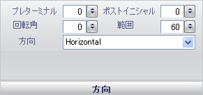

////

|metadata|
{
    "name": "wingauge-orientation-pane",
    "controlName": ["WinGauge"],
    "tags": ["Charting"],
    "guid": "{F5830118-8FAE-404F-9BB9-3C0434C5CE16}",  
    "buildFlags": [],
    "createdOn": "0001-01-01T00:00:00Z"
}
|metadata|
////

= 方向ペイン

[方向] ペインによって、ラジアル ゲージまたはリニア ゲージのラベルのルック アンド フィールをカスタマイズできます。

pick:[win-forms="link:{ApiPlatform}win.ultrawingauge{ApiVersion}~infragistics.ultragauge.resources.radialgaugescalelabelsappearance~orientation.html[方向]"]  -- 方向の値はラジアル ゲージ上のラベルの位置を決定します。方向を以下の値に設定できます。

* 水平 -- ラベルをゲージ上で水平に配置します。
* 角度 -- ラベルを時計回りの方向に配置します。
* 外側 -- ゲージの半径から外側を向いてラベルを配置します。

pick:[win-forms="link:{ApiPlatform}win.ultrawingauge{ApiVersion}~infragistics.ultragauge.resources.gaugescalelabelsappearance~preterminal.html[プリターミナル]"]  -- この値を 0 から 100 の整数に設定します。この値は、ラベルの終了値を設定するために使用されます。反時計回りの方向に回転し、[フォーマッティング] ペインの [頻度] 値で指定された間隔だけ減っていきます。

pick:[win-forms="link:{ApiPlatform}win.ultrawingauge{ApiVersion}~infragistics.ultragauge.resources.labelappearance~rotationangle.html[回転角度]"]  -- この値を 0 から 100 の整数に設定します。この値は時計回りの方向にラベルを回転します。

pick:[win-forms="link:{ApiPlatform}win.ultrawingauge{ApiVersion}~infragistics.ultragauge.resources.gaugescalelabelsappearance~postinitial.html[ポストイニシャル]"]  -- この値を 0 から 100 の整数に設定します。この値はラベルの開始値を決定し、時計回りの方向に回転して、 link:wingauge-formatting-pane.html[[フォーマッティング]] ペインの [頻度] 値で指定された間隔だけ増えていきます。

pick:[win-forms="link:{ApiPlatform}win.ultrawingauge{ApiVersion}~infragistics.ultragauge.resources.gaugescalelabelsappearance~extent.html[範囲]"]  -- この値を 0 から 100 の整数に設定します。ラジアル ゲージでは、この値は中心からのラベルの距離を指定します。リニア ゲージでは、この値はリニア ゲージの左側の距離を指定します。値を 100 を超えるまたは 0 未満に設定する場合、ラベルはゲージに表示されません。

== 関連トピック

link:wingauge-labels-layout-tab.html[ラベル レイアウト タブ]