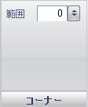

////

|metadata|
{
    "name": "wingauge-radial-gauge-corners-pane",
    "controlName": ["WinGauge"],
    "tags": ["Charting"],
    "guid": "{4BEF66E3-12FE-42D9-BDAE-499F8454F8EA}",  
    "buildFlags": [],
    "createdOn": "0001-01-01T00:00:00Z"
}
|metadata|
////

= 角ペイン

[角] ペインは、ラジアル ゲージ上の角の形状を決定するために使用されます。

pick:[win-forms="link:{ApiPlatform}win.ultrawingauge{ApiVersion}~infragistics.ultragauge.resources.gauge~cornerextent.html[範囲]"]  -- この値を 0 から 100 の整数に設定します。この値は、ラジアル ゲージの角の丸みを決定します。

== 関連トピック

link:wingauge-radial-gauge.html[ラジアル ゲージ]