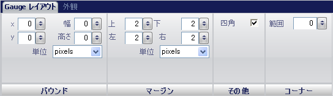

////

|metadata|
{
    "name": "wingauge-radial-gauge",
    "controlName": ["WinGauge"],
    "tags": ["Charting"],
    "guid": "{C284F0A2-B1D6-491E-8B04-3EE11587E203}",  
    "buildFlags": [],
    "createdOn": "0001-01-01T00:00:00Z"
}
|metadata|
////

= ラジアル ゲージ

ラジアル ゲージは、円形に情報を表示します。ラジアル ゲージは四角形にすることも可能ですが、針マーカーは円に回転します。時計はラジアル ゲージの一般的な例です。

ラジアル ゲージの表示をカスタマイズするには、[プロパティ] パネルの [ゲージ レイアウト] タブを使用します。ゲージ エクスプローラで [ラジアル ゲージ] をクリックする、またはインタラクティブなプレビュー領域でラジアル ゲージをクリックするのいずれかによって、このタブを表示できます。

タブは以下の 3 つのペインに分割されています。

* link:wingauge-bounds-pane.html[境界]
* link:wingauge-margin-pane.html[マージン]
* link:wingauge-corners-pane.html[角]
* link:wingauge-radial-misc-pane.html[その他]

以下のスクリーンショットは、上記のスクリーンショットで指定されたレイアウト設定に基づいて作成されたラジアル ゲージを示しています。

image::images/Radial_Gauge_Layout_Tab_02.png[]