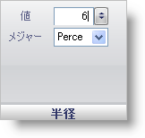

////

|metadata|
{
    "name": "wingauge-radius-pane",
    "controlName": ["WinGauge"],
    "tags": ["Charting"],
    "guid": "{C075E7F4-14BE-4C40-9F21-FFF77CA266B4}",  
    "buildFlags": [],
    "createdOn": "0001-01-01T00:00:00Z"
}
|metadata|
////

= 半径ペイン

[半径] ペインによって、アンカーの半径のサイズを変更できます。

pick:[win-forms="link:{ApiPlatform}win.ultrawingauge{ApiVersion}~infragistics.ultragauge.resources.radialgaugeneedleanchor~radius.html[値]"]  -- 数値スライダを使用して、0 から 100 の整数にこの値を設定します。ただし、値をテキスト ボックスに入力することも可能です。この値はアンカーの半径のサイズです。

pick:[win-forms="link:{ApiPlatform}win.ultrawingauge{ApiVersion}~infragistics.ultragauge.resources.radialgaugeneedleanchor~radiusmeasure.html[単位]"]  -- 半径の測定の単位を指定するには [単位] ドロップダウン リストを使用します。半径は、ピクセルまたはラジアル ゲージのパーセントで測定できます。

== 関連トピック

link:wingauge-anchor-layout-tab.html[アンカー レイアウト タブ]