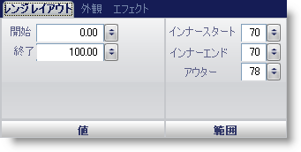

////

|metadata|
{
    "name": "wingauge-range-layout-tab",
    "controlName": ["WinGauge"],
    "tags": ["Charting"],
    "guid": "{E985A610-8EA8-4E2C-86EB-AF69432C5C45}",  
    "buildFlags": [],
    "createdOn": "0001-01-01T00:00:00Z"
}
|metadata|
////

= レンジ レイアウト タブ

Gauge コントロールの pick:[win-forms="link:{ApiPlatform}win.ultrawingauge{ApiVersion}~infragistics.ultragauge.resources.gaugerange.html[Range]"]  プロパティはスケール上の指定した値から開始し指定した値で終了する視覚的エレメントです。Range プロパティによって、スケールの特定の部分を強調表示することができます。たとえば、自動車のタコメータでは、高 RPM ゾーン（通常黄色と赤）は、最適なロードよりもエンジンの回転数が高いことを示します。

[プロパティ] パネルの [レンジ レイアウト] タブを使用して、スケールのレンジをカスタマイズできます。このタブを表示するには、ゲージ エクスプローラで [レンジ] をクリックします（[ラジアル ゲージ] > [スケール] > [レンジ]）。

タブは以下の 2 つのペインに分割されています。

* link:wingauge-value-pane.html[値]
* link:wingauge-extent-pane.html[範囲]

以下のスクリーンショットは、上記のスクリーンショットで指定されたレイアウト設定に基づいて作成されたレンジを示しています。

image::images/Range_Layout_Tab_02.png[]