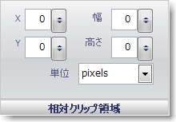

////

|metadata|
{
    "name": "wingauge-relative-clip-bounds",
    "controlName": ["WinGauge"],
    "tags": ["Charting"],
    "guid": "{F90F32CE-9505-4D00-9C5A-6BDB107289E2}",  
    "buildFlags": [],
    "createdOn": "0001-01-01T00:00:00Z"
}
|metadata|
////

= 相対クリップ領域

[相対クリップ領域] ペインは、ゲージ上の Brush 要素のクリップ領域のサイズと位置を決定します。

X -- この値は Gauge コントロールの左側からの Brush 要素のクリップ領域の距離を決定します。

Y -- この値は Gauge コントロールの上側からの Brush 要素のクリップ領域の距離を決定します。

Width -- この値はクリップ領域の幅を決定します。

Height -- この値はクリップ領域の高さを決定します。

Units -- この値はクリップ領域の測定の単位を指定します。クリップ領域は、ピクセルまたは Gauge コントロールのパーセントで測定できます。

== 関連トピック

link:wingauge-appearance-tab.html[外観タブ]

link:wingauge-digit-appearance-tab.html[数字外観タブ]

link:wingauge-labels-appearance-tab.html[ラベル外観タブ]

link:wingauge-effects-tab.html[効果タブ]