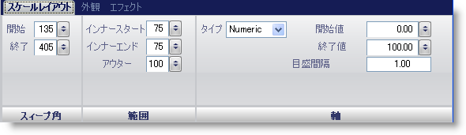

////

|metadata|
{
    "name": "wingauge-scale-layout-tab",
    "controlName": ["WinGauge"],
    "tags": ["Charting"],
    "guid": "{A6843A03-F775-4CB2-9184-739904ACE9CA}",  
    "buildFlags": [],
    "createdOn": "0001-01-01T00:00:00Z"
}
|metadata|
////

= スケール レイアウト タブ

Gauge コントロールの pick:[win-forms="link:{ApiPlatform}win.ultrawingauge{ApiVersion}~infragistics.ultragauge.resources.gaugescale.html[Scale]"]  プロパティは、リニア ゲージまたはラジアル ゲージに値の範囲を表示するために使用されます。目盛をゲージに追加することによって、ゲージ上のスケールの値を視覚的に表示することが可能となります。

[プロパティ] パネルの [スケール レイアウト] タブを使用して、ゲージ上のスケールをカスタマイズできます。ゲージ エクスプローラで [スケール] をクリックする（[ラジアル ゲージ/リニア ゲージ] > [スケール]）、またはインタラクティブなプレビュー領域でスケールをクリックすることによって、このタブにアクセスできます。

タブは以下の 3 つのペインに分割されています。

* link:wingauge-sweep-angle-pane.html[スイープ角度]
* link:wingauge-extent-pane.html[範囲]
* link:wingauge-axis-pane.html[軸]

以下のスクリーンショットは、上記のスクリーンショットで指定されたレイアウト設定に基づいて作成されたスケールを示しています。

image::images/Scale_Layout_Tab_02.png[]