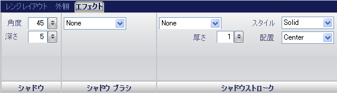

////

|metadata|
{
    "name": "wingauge-shadow-pane",
    "controlName": ["WinGauge"],
    "tags": [],
    "guid": "{1A2E711B-B54A-4719-BCE6-1B608AC9AB36}",  
    "buildFlags": [],
    "createdOn": "0001-01-01T00:00:00Z"
}
|metadata|
////

= シャドー ペイン

[効果] タブはゲージ プロパティのすべてに関連しています。この [効果] タブによって、WinGauge コントロールの任意のプロパティにシャドーを追加することができます。ゲージエクスプローラーで任意の項目をクリックする、またはインタラクティブなプレビュー領域でゲージ上の任意の項目をクリックすることによって、このタブにアクセスできます。

このタブは以下の 3 つのペインに分割されています。

* link:wingauge-shadow-pane.html[シャドー ペイン]
* link:wingauge-shadow-brush-pane.html[シャドー ブラシ ペイン]
* link:wingauge-shadow-stroke-pane.html[シャドー ストローク ペイン]

以下のスクリーンショットは、上記のスクリーンショットで指定された設定に基づいてスケールのレンジに適用される効果を示しています。

image::images/Effects_Tab_02.png[Radial wingauge using settings based on screen shot above.]