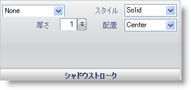

////

|metadata|
{
    "name": "wingauge-shadow-stroke-pane",
    "controlName": ["WinGauge"],
    "tags": ["Charting"],
    "guid": "{63C5E5CA-3FA6-413C-B5EC-594DB4DD0C74}",  
    "buildFlags": [],
    "createdOn": "0001-01-01T00:00:00Z"
}
|metadata|
////

= シャドー ストローク ペイン

[シャドー ストローク] ペインによって、 link:wingauge-shadow-brush-pane.html[[シャドー ブラシ] ペイン]で作成したシャドーの周囲に境界線を追加することができます。

pick:[win-forms="link:{ApiPlatform}win.ultrawingauge{ApiVersion}~infragistics.ultragauge.resources.strokeelement~brushelement.html[ブラシ タイプ]"]  -- このドロップダウン リストによって、プロパティのブラシ タイプを変更できます。

pick:[win-forms="link:{ApiPlatform}win.ultrawingauge{ApiVersion}~infragistics.ultragauge.resources.strokeelement~brushelement.html[ブラシの色]"]  -- 選択するブラシのタイプによって、ブラシの色のリストにそのブラシ タイプで使用可能な色が格納されます。

pick:[win-forms="link:{ApiPlatform}win.ultrawingauge{ApiVersion}~infragistics.ultragauge.resources.strokeelement~dashstyle.html[スタイル]"]  -- この値は、シャドーの境界線の破線のスタイルを指定します。

pick:[win-forms="link:{ApiPlatform}win.ultrawingauge{ApiVersion}~infragistics.ultragauge.resources.strokeelement~thickness.html[太さ]"]  -- この値を 0 から 100 の整数に設定します。この値は、シャドーの境界線の太さを指定します。

pick:[win-forms="link:{ApiPlatform}win.ultrawingauge{ApiVersion}~infragistics.ultragauge.resources.strokeelement~alignment.html[配置]"]  -- この値は、シャドーの境界線の位置を指定します。

== 関連トピック

link:wingauge-effects-tab.html[効果タブ]