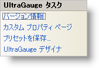

////

|metadata|
{
    "name": "wingauge-smart-tag",
    "controlName": ["WinGauge"],
    "tags": ["API","Charting","Design Environment"],
    "guid": "{79C7E7EE-79DF-47ED-A02F-2642007110B6}",  
    "buildFlags": [],
    "createdOn": "0001-01-01T00:00:00Z"
}
|metadata|
////

= スマート タグ

Visual Studio 2005（.NET Framework 2.0）では、{ProductName} コントロール/コンポーネントがそれぞれ固有のスマート タグを備えています。コントロールやコンポーネントを選択するだけで、スマート タグのアンカーが表示されます。このアンカーをクリックするとポップアップ パネルが表示され、そこからコントロール/コンポーネントの最もよく使用するプロパティや設定にすばやく簡単にアクセスできます。

WinGauge のスマート タグには次のリンクが含まれています。

* バージョン情報 -- Gauge コントロールの [UltraGauge について] ダイアログ ボックスを表示します。このダイアログ ボックスにはライセンスおよびバージョン情報が含まれています。
* カスタム プロパティ ページ -- [カスタム プロパティ ページ] ダイアログ ボックスを開きます。Visual Studio の [プロパティ] ウィンドウを使用するのではなく、このダイアログ ボックスを使用して、Gauge コントロールのプロパティを参照および変更することができます。
* プリセットを保存 -- ゲージを link:wingauge-creating-a-gauge-using-a-preset.html[プリセット]として保存することができます。
* UltraGauge デザイナ -- link:wingauge-designer.html[ゲージ デザイナ]を起動します。ゲージ デザイナによって、ゲージのルック アンド フィールを素早く簡単に修正できます。

