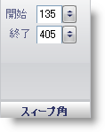

////

|metadata|
{
    "name": "wingauge-sweep-angle-pane",
    "controlName": ["WinGauge"],
    "tags": ["Charting"],
    "guid": "{CA1564AB-5694-47AA-8641-320175046EDF}",  
    "buildFlags": [],
    "createdOn": "0001-01-01T00:00:00Z"
}
|metadata|
////

= スイープ角度ペイン

[スイープ角度] ペインは、スケールの開始角度と終了角度を決定します。

pick:[win-forms="link:{ApiPlatform}win.ultrawingauge{ApiVersion}~infragistics.ultragauge.resources.radialgaugescale~startangle.html[開始]"]  -- この値を -999 から 999 の値に設定します。この値はスケールの開始角度を決定します。

pick:[win-forms="link:{ApiPlatform}win.ultrawingauge{ApiVersion}~infragistics.ultragauge.resources.radialgaugescale~endangle.html[終了]"]  -- この値を -999 から 999 の値に設定します。この値はスケールの終了角度を決定します。

== 関連トピック

link:wingauge-scale-layout-tab.html[スケール レイアウト タブ]